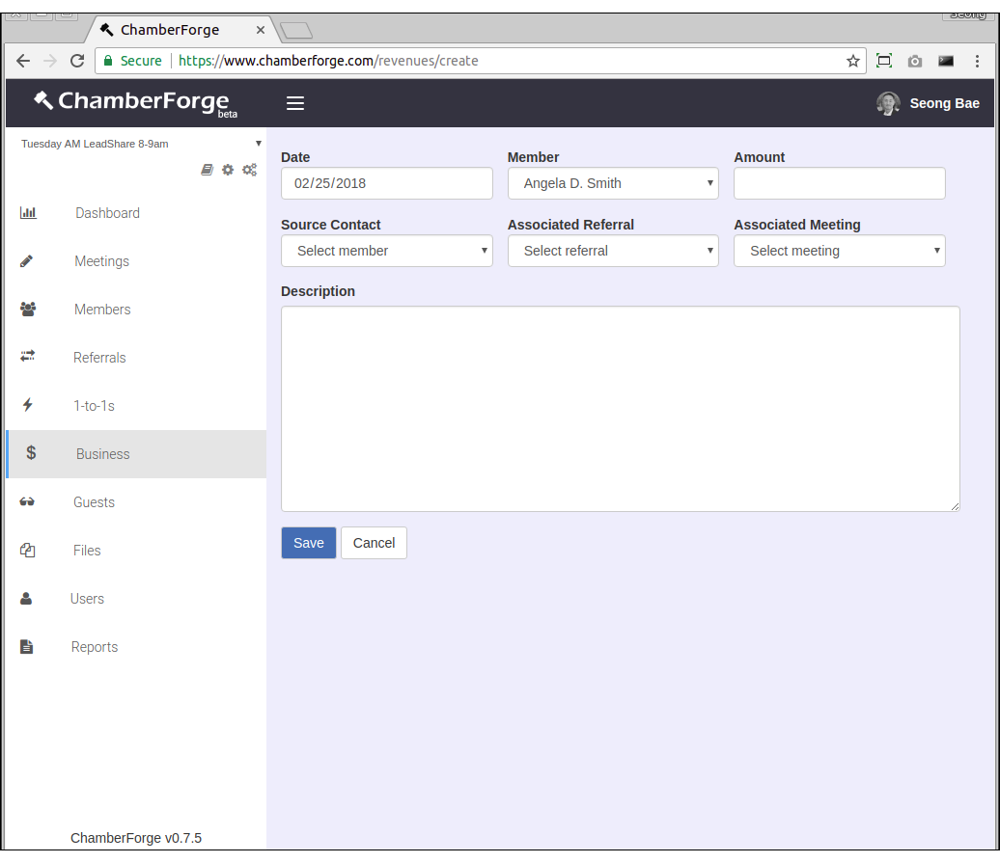
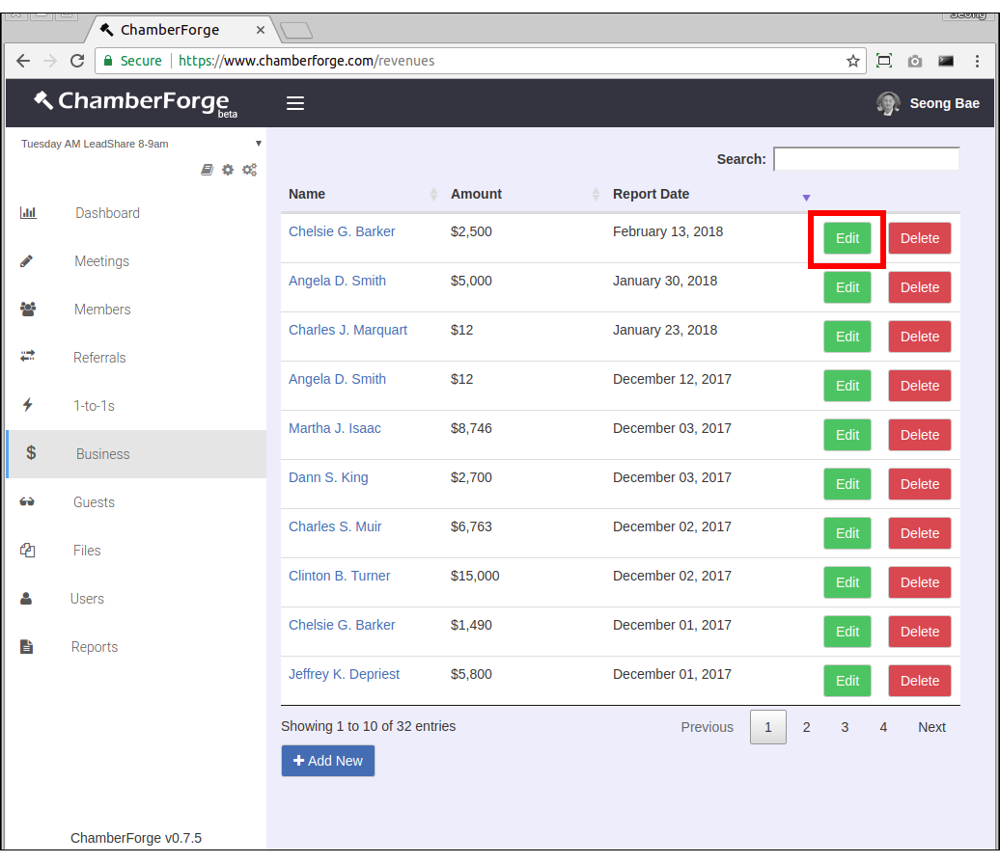
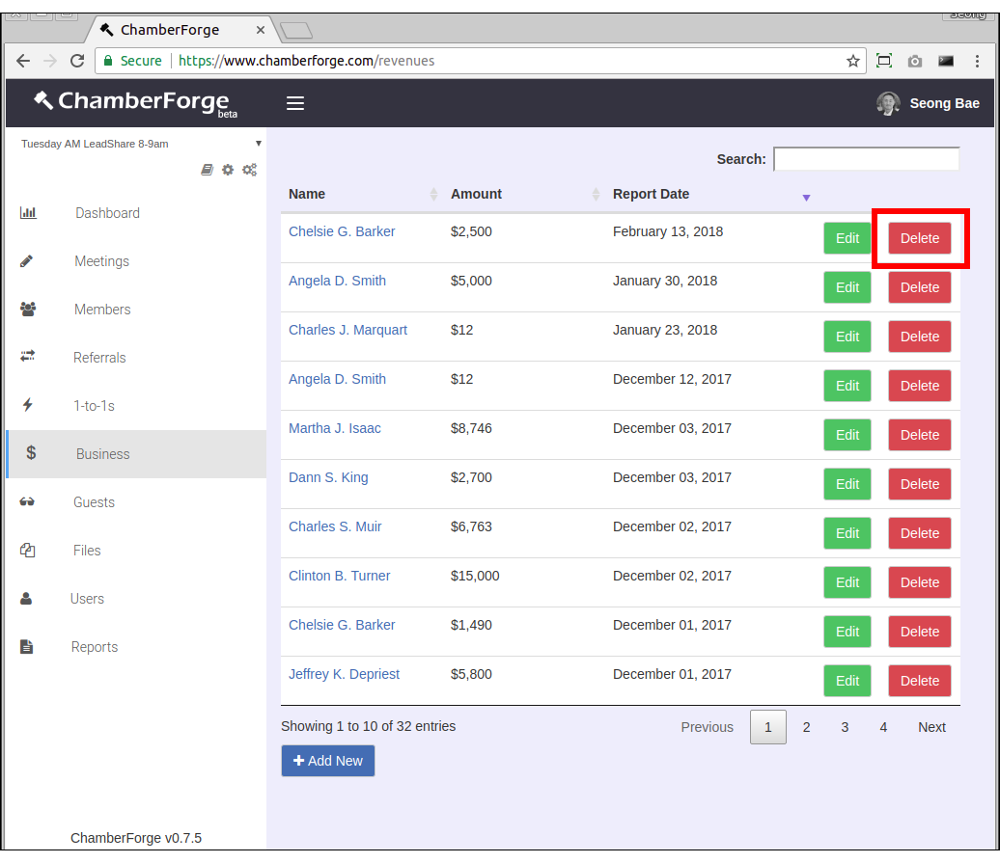
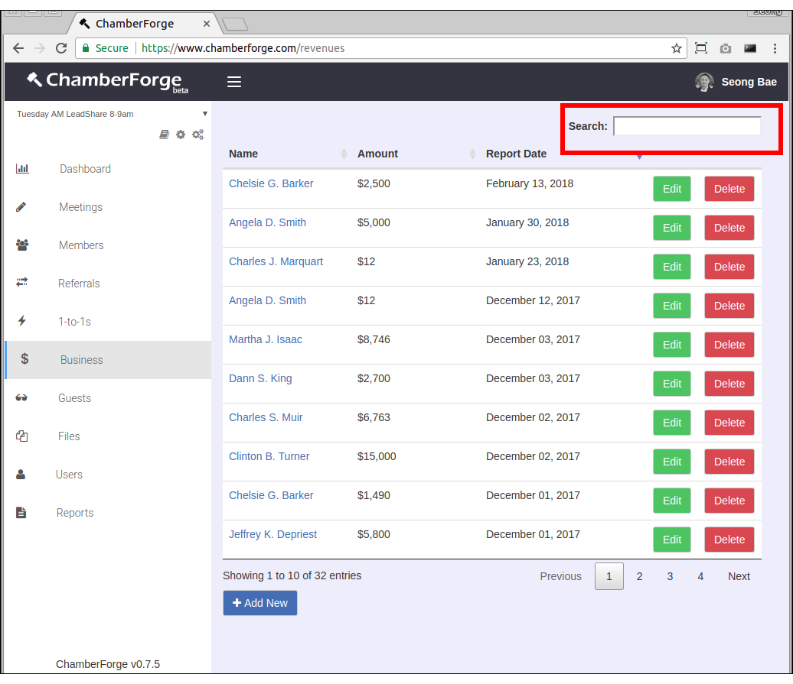

# Business Closed

When a member reports business closed, it can be tracked with ChamberForge.

## Add Business Closed

You can add a new business closed item by going to the Business from the left navigation menu and clicking on the Add New button.

The only required field is member who closed business - rest of the fields are optional.  Following describes fields in more detail:

- **Date**: Date of business closed or reported
- **Member**: Member who closed business
- **Amount**: Amount of business closed
- **Source Contact**: Member who provided lead or referral
- **Associated Referral**: Referral that turned into business closed
- **Associated Meeting**: If this was reported at a meeting, you can associate the business closed to the meeting

## Edit Business Closed

You can edit an existing business closed by clicking on the Edit button on the business closed item you want to edit from the listing screen.

## Delete Business Closed

You can delete an existing business closed by clicking on the Delete button on the business closed you want to delete from the listing screen. 

## Search Business Closed

You can search business closed by member name.  Use the search field on top right hand corner to filter business closed by name.

