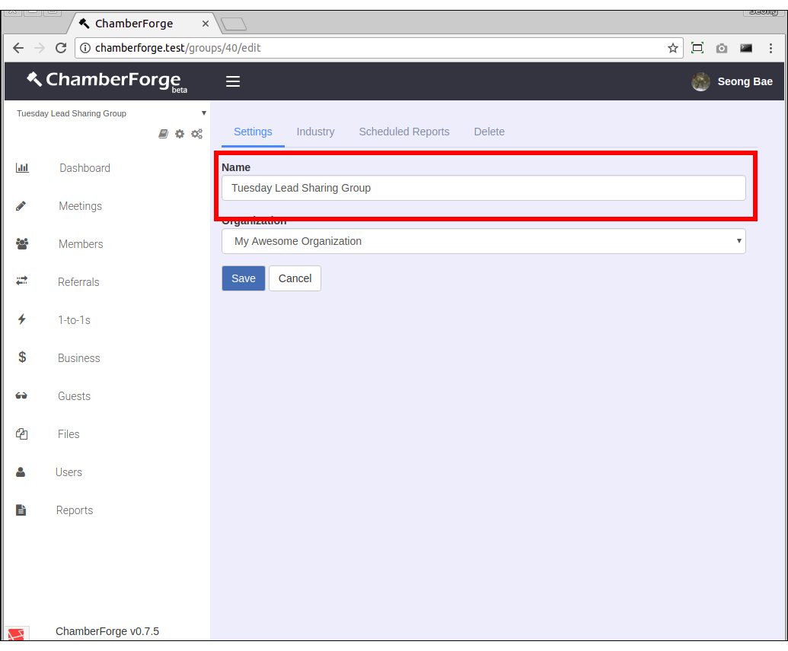
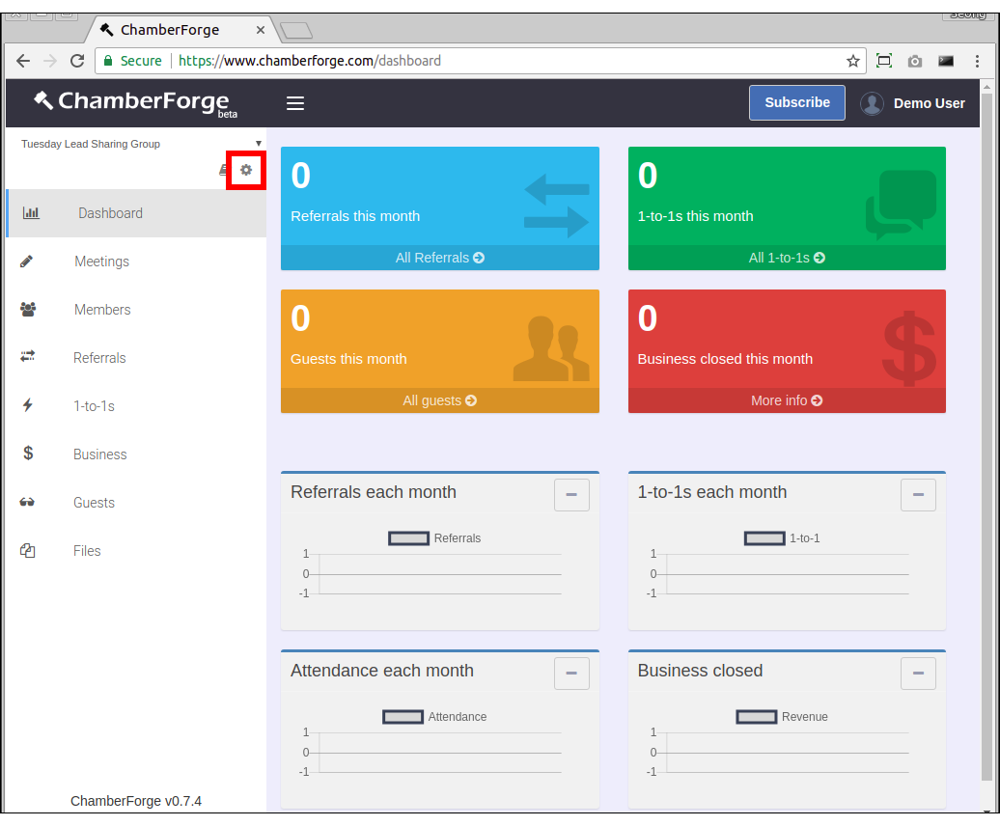
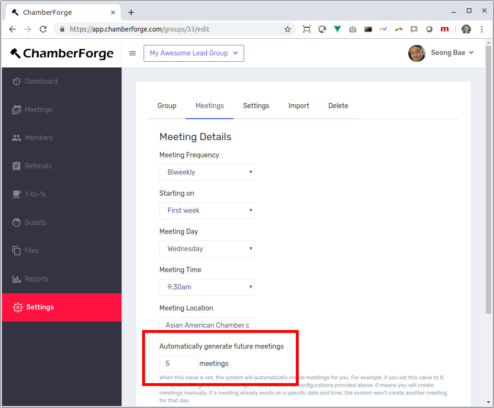
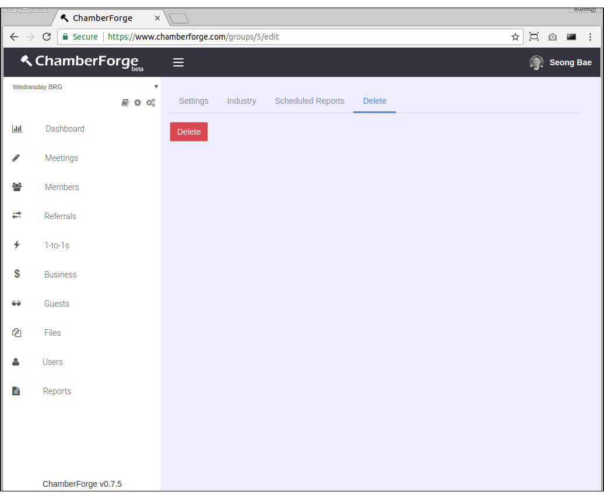

# Group

One of the first things you should do as you get started with ChamberForge is setting up your group page.  After that, you can add group members, meetings, referrals, and so forth.

This article walks you through creation and setting up of a group.

## Create a Group

There are two ways to create a group: through home screen and through organization page. 

If you are on a free or a trial plan, or if the organization you belong to has given you access to create groups, you can create a group from your home screen.  Home screen is the first screen you see after logging in.  You can also get to it by clicking on the logo on upper left hand.

If you are a paid subscriber and have created your organization, then you can use the organization page to create a group.  For creating a group through the organization page, pleaes refer to the Organization documentation.

Click on the "Create new group" button and enter a name for your group.  After that, your group will be created and you will be automatically redirected to your group dashboard page.

## Change Group Information

You can change the name of your group from the Settings tab of group settings page.

## Group Settings

To manage your group such as changing name, adding industry information, or scheduling automated report, you can go to the Group Settings page to do so.  

To go to the Group Settings page, click on the small gear icon on top left hand corner.  Please note that the icon with one gear is for group settings and the icon with three gears is for organization settings.  Latter is only visible if you are a paid subscriber and have created an organization.

## Meeting Details

When creating a group, you can add details on meetings.  This information will be used for setting up automated meetings and receiving RSVPs from guests.

## Automated Meeting Generation

Sometimes, you may want to create future meetings ahead in time to better organize and allow members to tag guests to a future meeting.  This requires you to manually create meetings one by one which can be repetitive and cumbersome work.  

The Automated Meeting feature allows you to automatically generate meetings.  After providing the meeting details for your group, simple set a value for the Automatically generate future meetings field.  This field will be 0 by default, meaning you will be creating meeting entries manually.  If you provide a value greater than 0, then the system will start automatically generating future meetings for you.

For example, let's say you set up your meeting with following details:

* Meeting frequency: biweekly
* Starting on: Second week
* Meeting day: Tuesday
* Meeting time: 9:30am
* Automatically generate future meetings: 4 meetings

This tells the system to always have 4 future meetings created.  At midnight everynight, the system will automatically gnerate meetings to ensure that there are always 4 meetings created in future.  So if today is August 24, 2019, the above configuration will generate following meeting entries for you:

* 9:30am August 28, 2019 (next meeting after August 24th)
* 9:30am September 11, 2019
* 9:30am September 25, 2019
* 9:30am October 9, 2019

You can set this to 8 meetings or 12 meetings. It's totally up to you.  And if your group meets regularly and you enable this feature, then you will never have to manually create meetings again.

## Delete Group

You can delete a group by going to the Delete tab within the Group settings page. 

