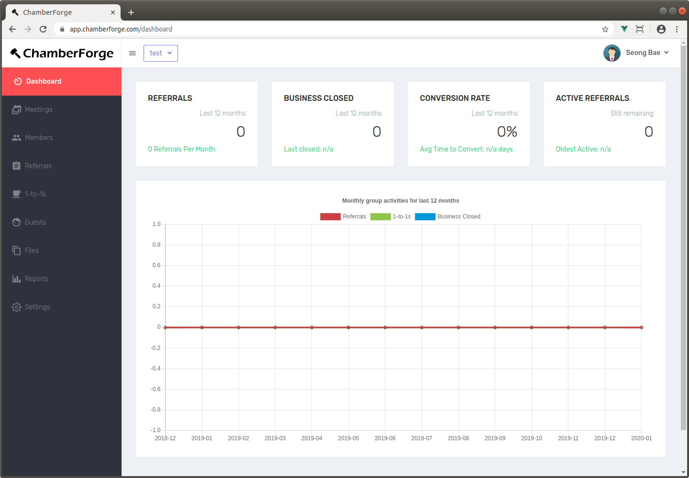
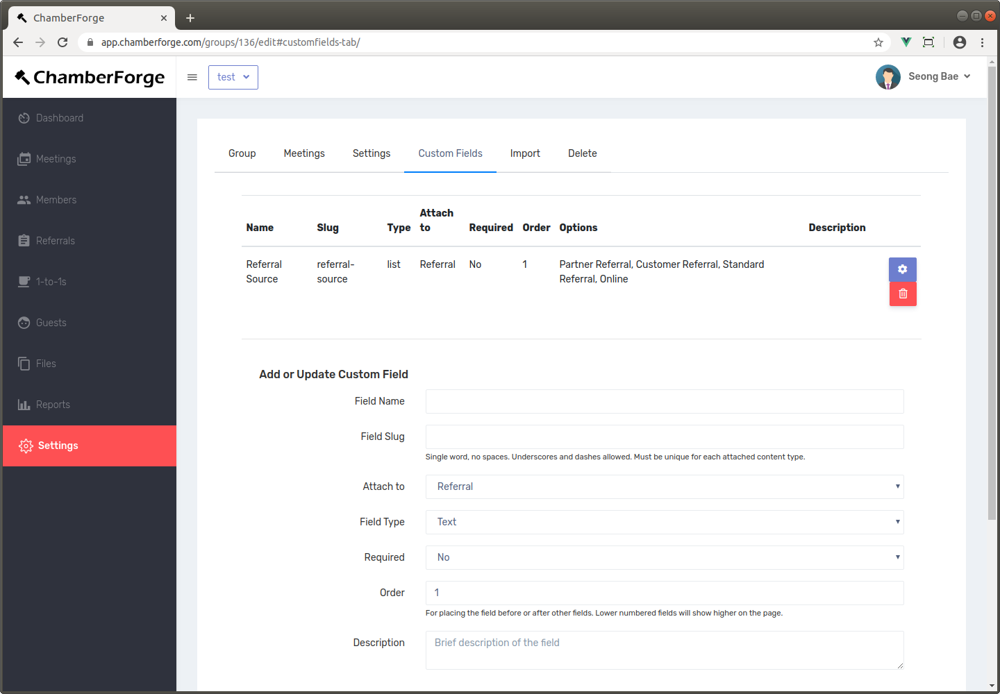
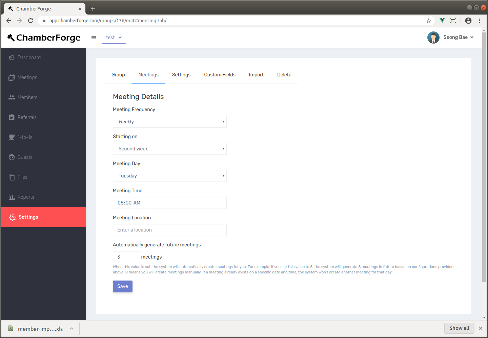

# Group

One of the first things you should do as you get started with ChamberForge is setting up your group.  Once your group is created, you can add/invite members, create meetings, manage members and guests and so forth.

## Create a Group

To create a group, after logging in, go to the menus on top right and click on the Create a Group menu.  The wizard will walk you through the process and you can add various details about your group including name, description, when and where you meet.  Once the group is created, you will be taken to the group's dashboard page.  Below is what the dashboard screen looks like when a new group is created:

Click on the "Create new group" button and enter a name for your group.  After that, your group will be created and you will be automatically redirected to your group dashboard page.

## Settings

***Reporting Type***

- **Within group only**: allow referrals and 1-to-1s only between group members to be reported
- **Within organization only**: allow referrals and 1-to-1s between members from different groups - but under same organization - to be reported

***Guest Count***

- **Count by entry**: when reporting guest count for members, count by number of guests entered into the system. 
- **Count by attendance**: when reporting guest count for members, count by guest attendance.  With this option, a same guest can attend multiple meetings to a same grouop and the person who invited the guest each time will each receive a credit. 

## Custom Fields

Custom fields allow additional data to be collected from members when they report referrals or 1-to-1s.  

For example, you can add a dropdown list caleld "Referral Source" with values such as partner referral, customer referral, standard referral, online referral to allow your members to indicate the type of referral when reporting.  This additional information allows members to share more information and you can use them in the reports to gain additional insights.

## Automated Meeting Generation

Sometimes, you may want to create future meetings ahead in time to better organize and allow members to tag guests to a future meeting.  This requires you to manually create meetings one by one which can be repetitive and cumbersome work.  

The Automated Meeting feature allows you to automatically generate meetings.  After providing the meeting details for your group, simple set a value for the Automatically generate future meetings field.  This field will be 0 by default, meaning you will be creating meeting entries manually.  If you provide a value greater than 0, then the system will start automatically generating future meetings for you.

For example, let's say you set up your meeting with following details:

* Meeting frequency: biweekly
* Starting on: Second week
* Meeting day: Tuesday
* Meeting time: 9:30am
* Automatically generate future meetings: 4 meetings

This tells the system to always have 4 future meetings created.  At midnight everynight, the system will automatically gnerate meetings to ensure that there are always 4 meetings created in future.  So if today is August 24, 2019, the above configuration will generate following meeting entries for you:

* 9:30am August 28, 2019 (next meeting after August 24th)
* 9:30am September 11, 2019
* 9:30am September 25, 2019
* 9:30am October 9, 2019

You can set this to 8 meetings or 12 meetings. It's totally up to you.  And if your group meets regularly and you enable this feature, then you will never have to manually create meetings again.

## Delete Group

If you no longer need to maintain a group, you can delete the group by going to the Delete tab within the Group settings page.

> Deleting a group will delete all the data except referrals.  Referral data is managed by giver and receiver.