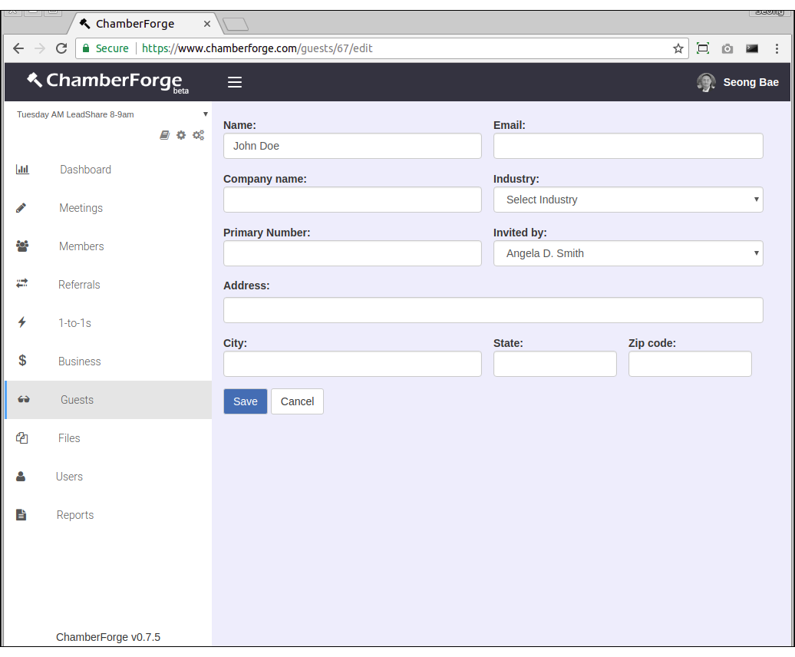
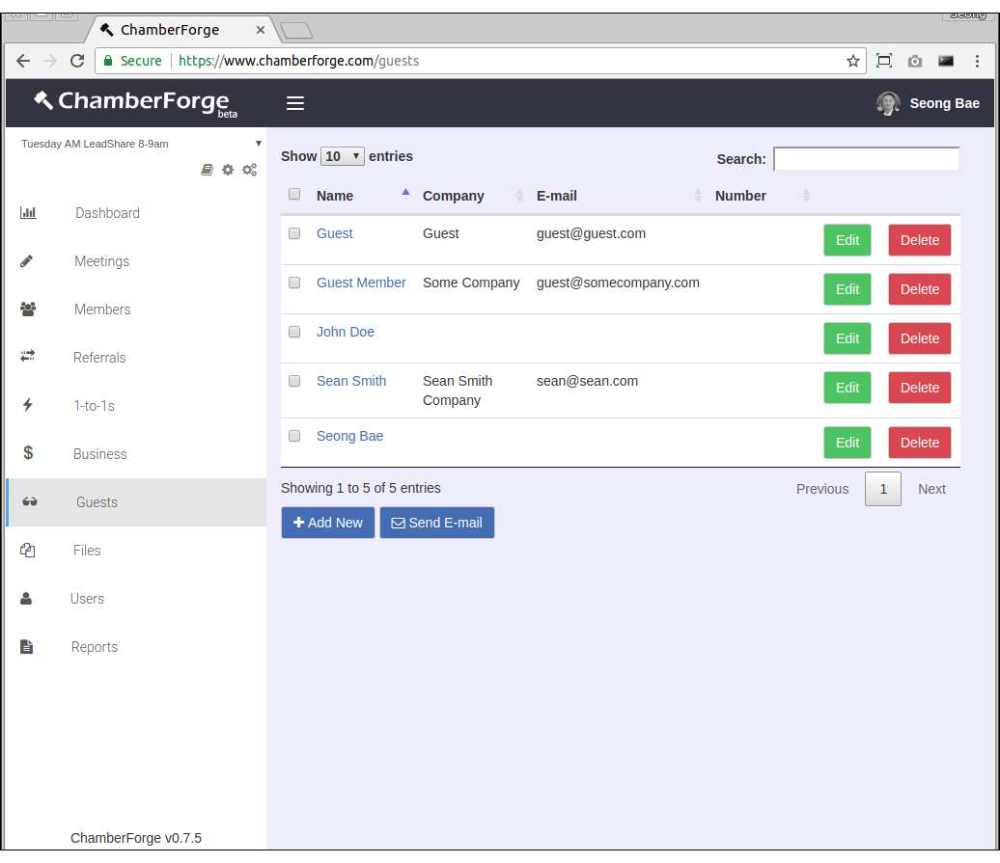
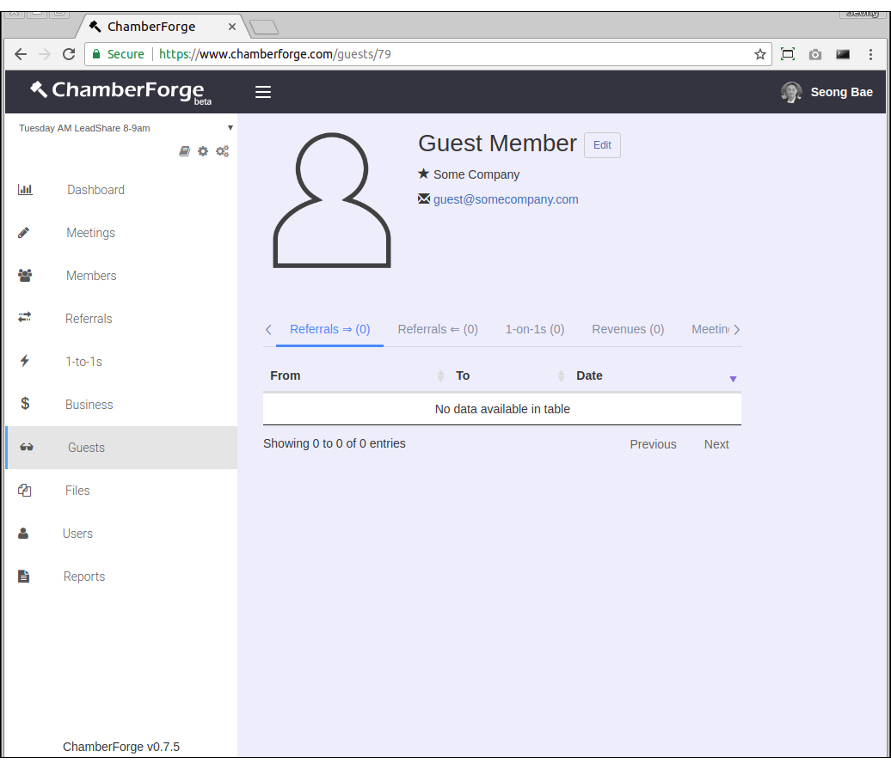

# Guests

Guests who have been invited to a group or attended a meeting can be added to ChamberForge.  

## Add a Guest

There are two ways to add a guest: through the Guests screen and through a meeting page.

The screen for adding guests is very similar to the Add a Member screen.  The only required field is the name field - rest of the fields are optional.  You can also choose which member has invited the guest.

Click on the Guests from left navigation menu and then Add New to add a new guest.

## Edit a Guest

You can make changes to guest information by going to the Guests page and clicking on Edit next to the guest you want to modify data.

## Guest Details

You can click on any guest's name to view his or her details.  The details screen shows various information about a guest and his/her activities within the group including following:

- Referrals given (first tab)
- Referrals received (second tab)
- 1-to-1 meetings conducted (third tab)
- Guests invited to a group (fourth tab)
- Business closed (fifth tab)
- Meetings attended (sixth tab)

## Delete a Guest

You can delete a guest from group by going to the Guests listing screen and clicking on Delete button next to the guest.

