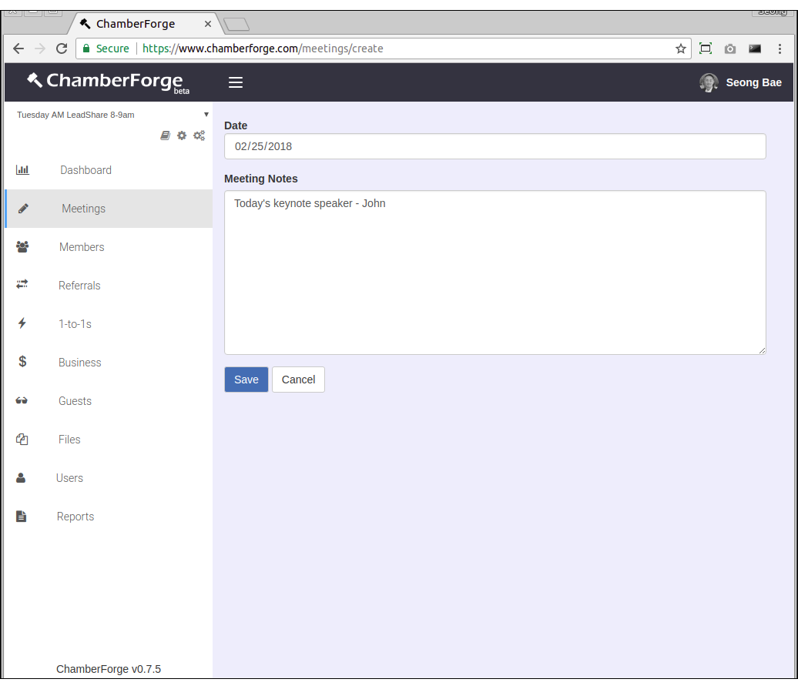
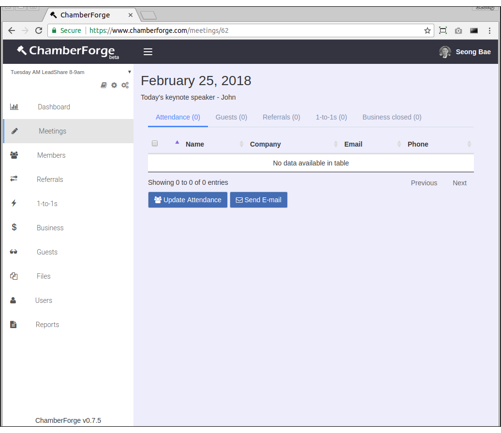
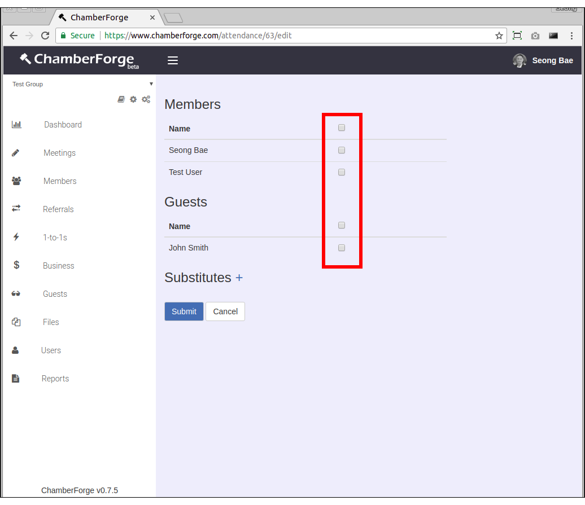
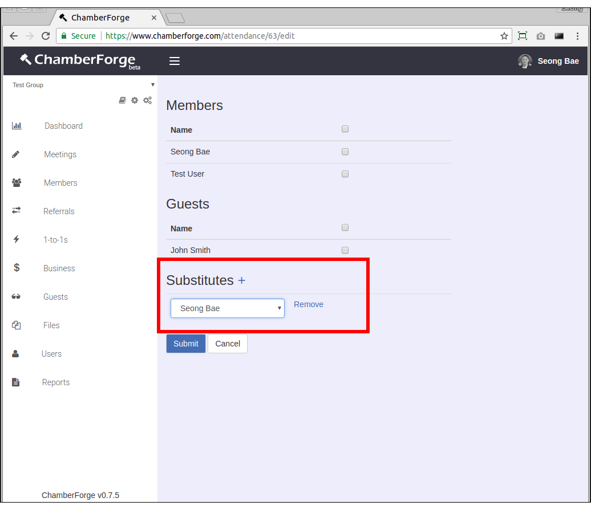
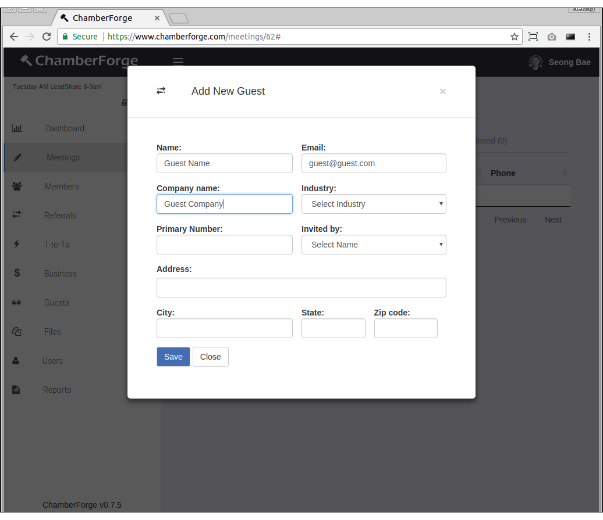
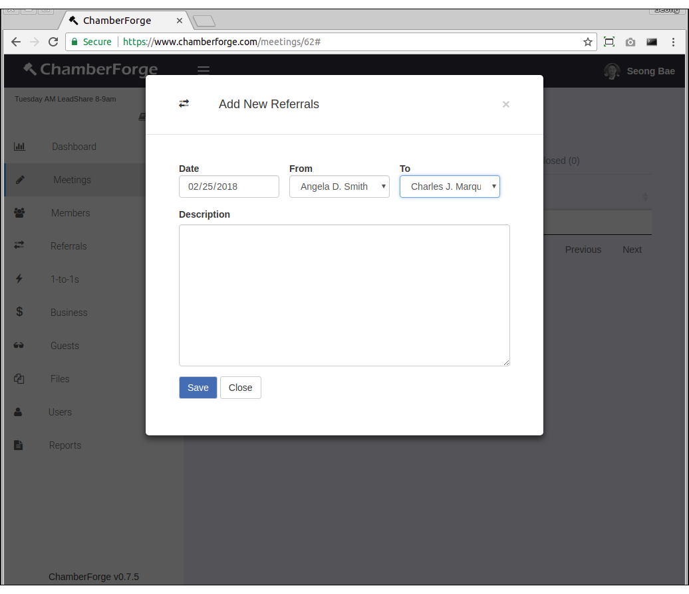
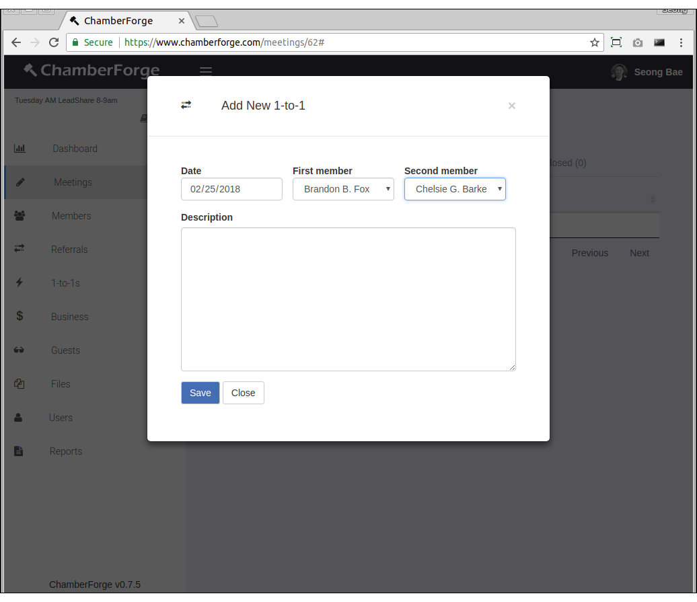
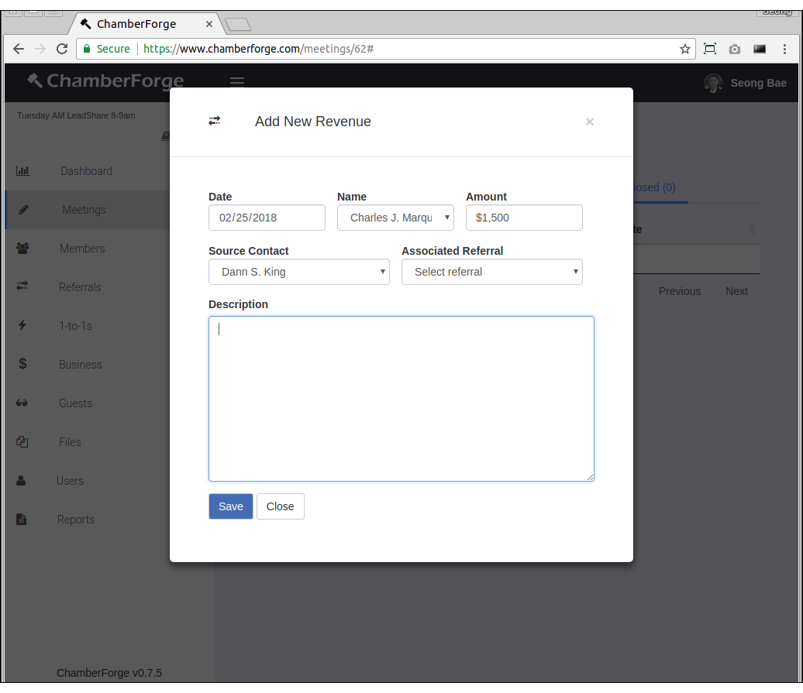
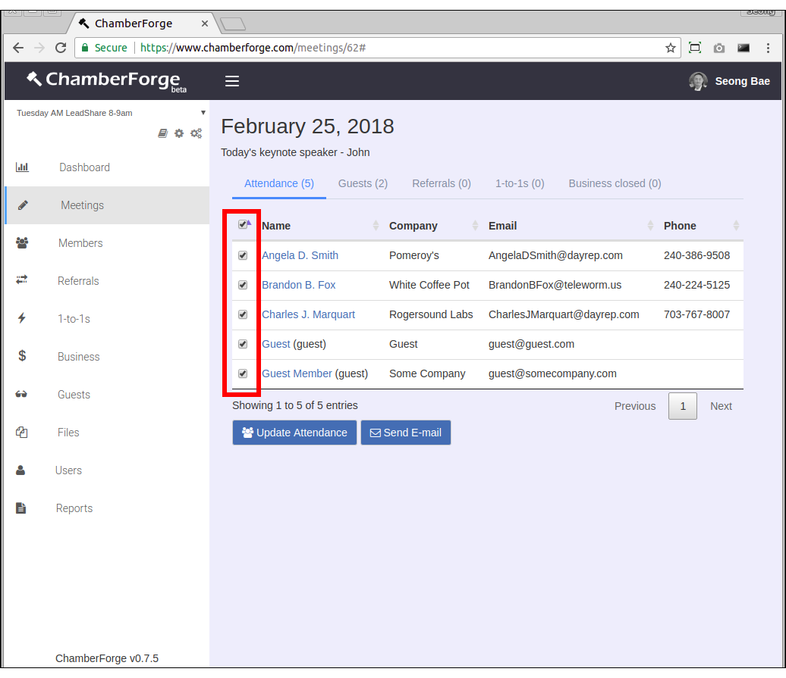
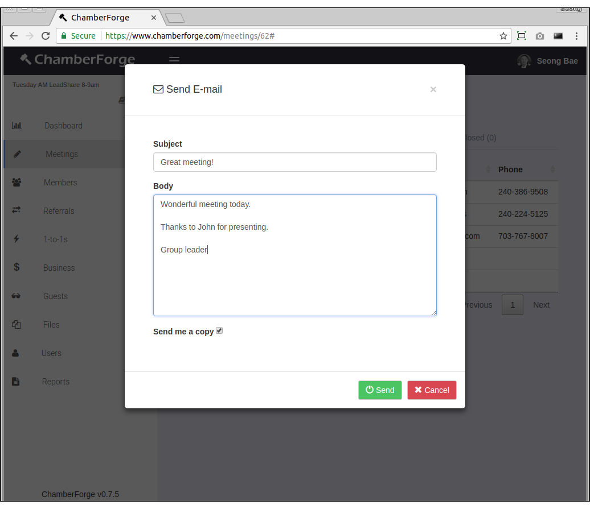

# Meeting

Tracking meetings and meeting attendance with ChamberForge is very easy.  This page walks you through how to create and manage meetings.

## Create a Meeting

You can create a meeting by going to Meetings from left navigation menu and clicking on Add New.  You can create a meeting after a meeting has taken place or create for upcoming meetings.

- **Date**: date of the meeting
- **Meeting Notes**: any notes or description about the meeting (optional)

You will be taken to the meeting details screen.

## Track Attendance

After a meeting has been created, you can track attendance by going to the meeting details screen and clicking on Update Attendance button.  You will see members and guests of the group with checkbox next to their name.  Simply check the checkbox to denote the member or guest's meeting attendance.

If you have a large group, checking each checkbox can be a tedious process.  You can check all by checking the topmost checkbox.

## Denote Substitute

If a member cannot make to a meeting and sends a subsitute in his or her place, you can denote that a substitute attended the meeting.

Simply click on the plus (+) sign next to Substitute and select the member who sent a substitute in his or her place.

Substitute information will be displayed accordingly throughout the meeting data and reports.  To remove substitute information, simply click on Remove link next to the name.

## Add Guest

In addition to being able to add guests through the Guests page, you can also add them through each meeting details page.  

From meeting details page, click on the Guests tab and then Add New Guest button at the bottom.  When a window opens, fill in guest information and click on Save.  

## Add Referral

Similar to guests, referrals can be added from meeting details screen.  

From meeting details page, click on the Referrals tab and then Add New button at the bottom.  When a window opens, fill in referral information and click on Save.  The referral will automatically be associated with the current meeting.

The only required information is name field.  All other fields are optional.

## Add 1-to-1

Similar to guests and referrals, 1-to-1s can be added from meeting details screen as well.	

From meeting details page, click on the 1-to-1s tab and then Add New button at the bottom.  When a window opens, fill in the 1-to-1 meeting information and click on Save.  The 1-to-1 will automatically be associated with the current meeting.

First member and Second member are both required.

## Add Business Closed

Similar to guests and referrals, business closed can be added from meeting details screen.	

From meeting details page, click on the Business Closed tab and then Add New button at the bottom.  When a window opens, fill in the business closed information and click on Save.  The business closed will automatically be associated with the current meeting.

The only required information is name field.  All other fields are optional.

## Send E-mails

You can send an e-mail to all meeting attendees.  Click on the Attendance tab from meeting details screen, check the checkbox next to each attendee, and click on the Send E-mail button.  You can select all attendees by checking the topmost checkbox.

ChamberForge currently does not archive emails sent from the system.  If you wish to keep an archive of emails sent out, you can check the checkbox to have a copy sent to your email.

