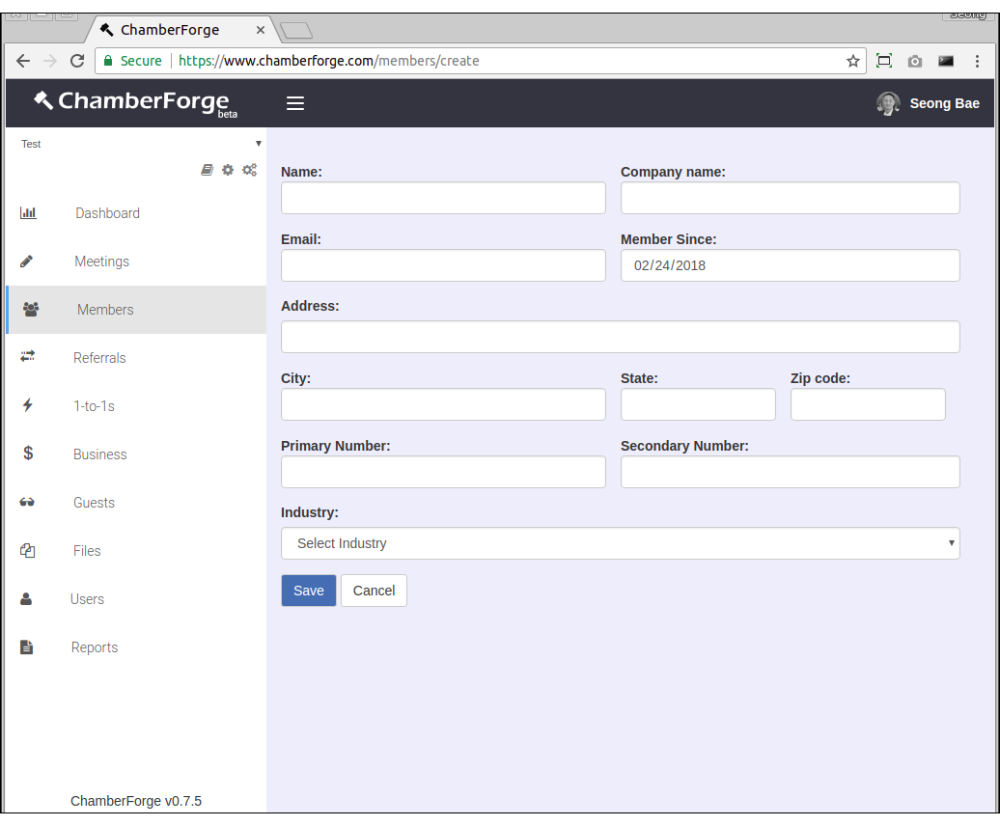
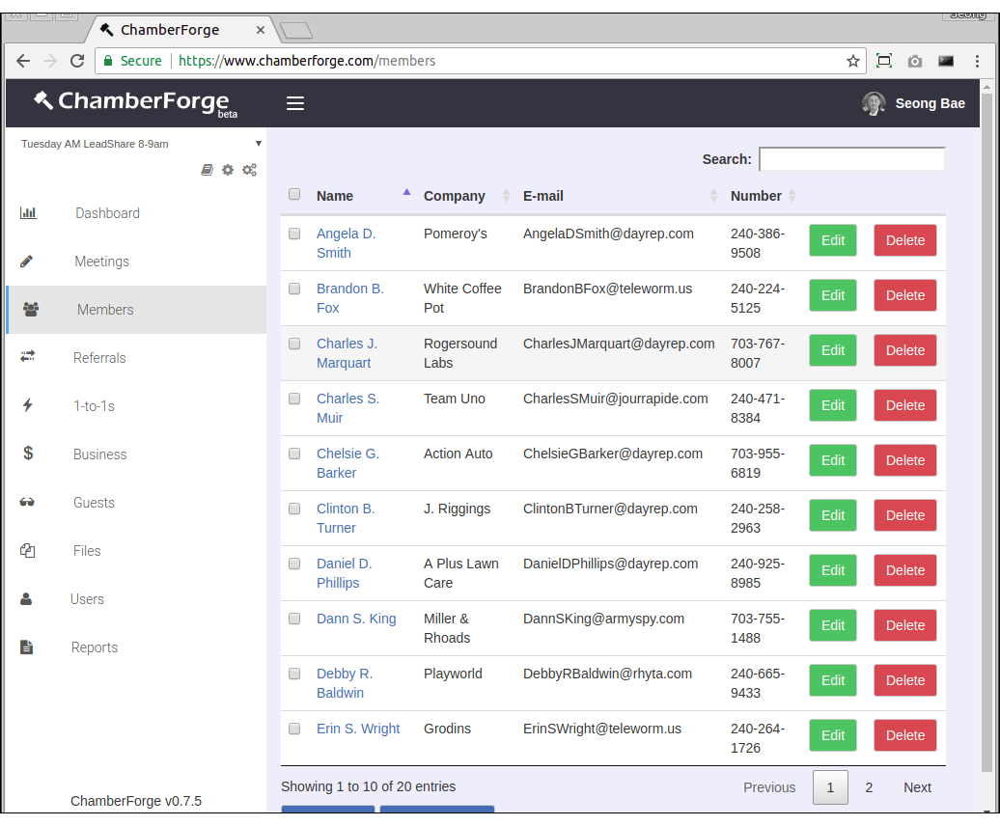
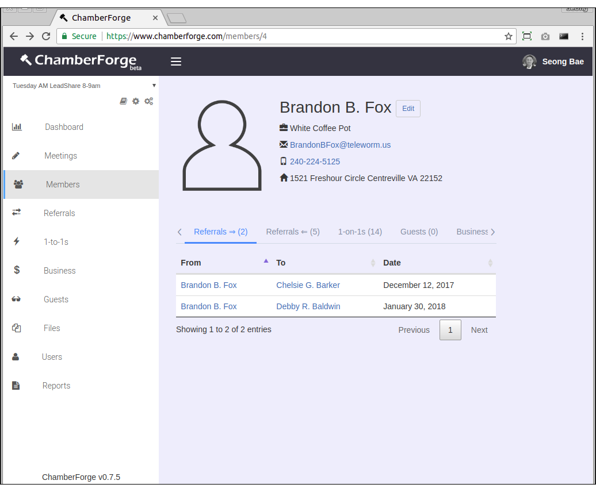

# Members

After creating a group and industry list, the next thing you want to do is add members of your group to ChamberForge.

This article walks you through manage members of your group including adding, editing, and deleting members.

## Add a Member

You can add a member to a group by going to Members from the left navigation menu and then clicking on "Add New".  Enter member information on the next screen.  

The minimum required fields when adding a member are:

- Name
- Company name
- E-mail

Rest of the fields are optional and can be left blank.

Click on the "Create new group" button and enter a name for your group.  After that, your group will be created and you will be automatically redirected to your group dashboard page.

## Edit a Member

You can make changes to member information by going to Members page and clicking on Edit next to the member you want to modify data.

## Member Details

You can click on any member's name to view his or her details.  The details screen shows various information about a member and his/her activities within the group including following:

- Referrals given (first tab)
- Referrals received (second tab)
- 1-to-1 meetings conducted (third tab)
- Guests invited to a group (fourth tab)
- Business closed (fifth tab)
- Meetings attended (sixth tab)

## Delete a Member

You can remove a member from group by going to the Members listing screen and clicking on Delete button next to the member.

