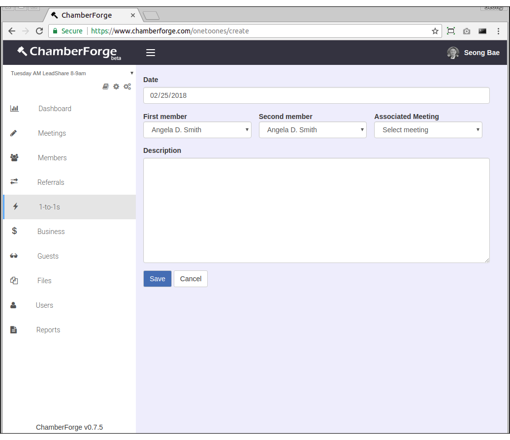
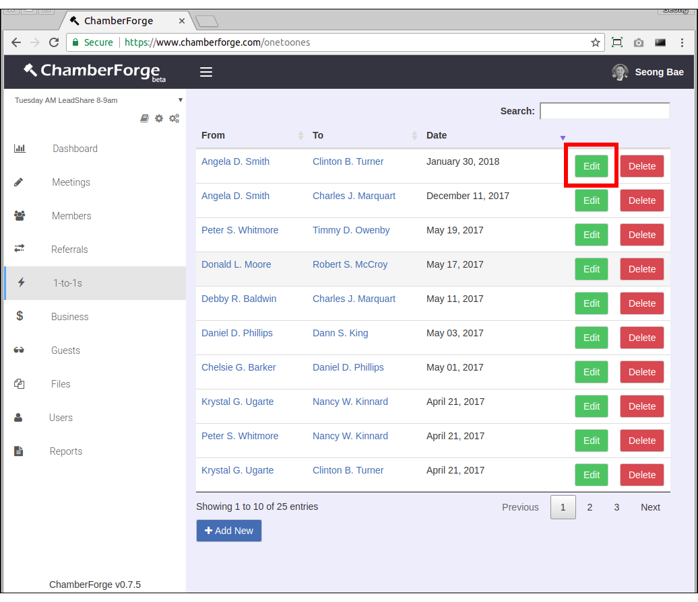
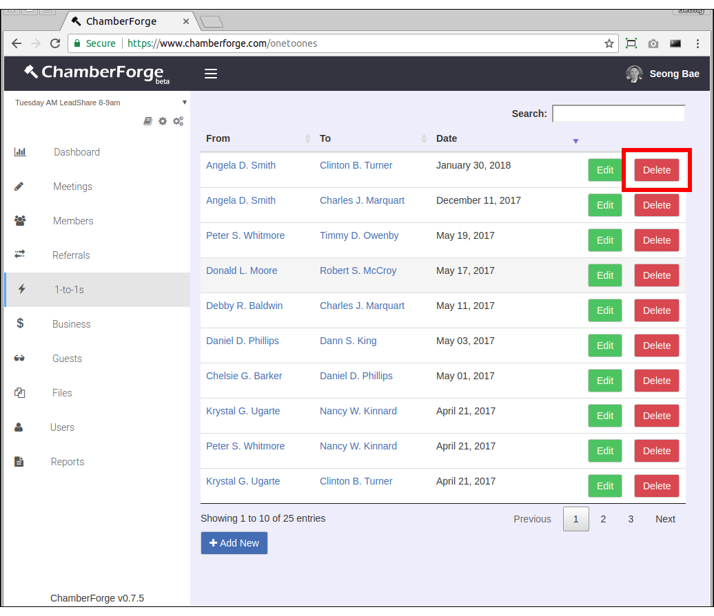
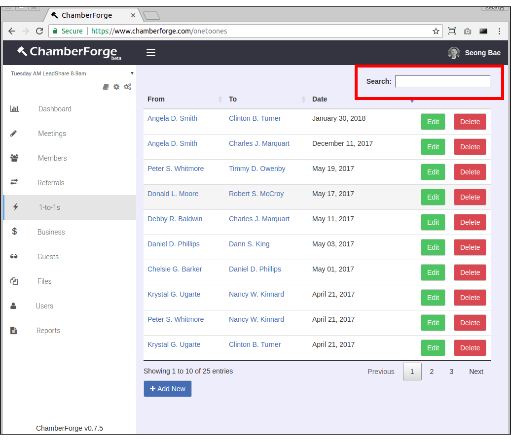

# 1-to-1

When members have 1-to-1 meetings with each other or with guests, it can be tracked with ChamberForge.  

## Add 1-to-1

You can add 1-to-1 meetings by going to 1-to-1 screen from the left navigation menu and clicking on the Add New button.

The required fields are the two persons who had the meeting - rest of the fields are optional.  Following are fields on the 1-to-1's Add New page:

- **Date**: Date of the meeting
- **First Member**: Person 1 having the meeting
- **Second Member**: Person 2 having the meeting
- **Associated Meeting**: If this was reported at a meeting, you can associate the 1-to-1 to the meeting
- **Description**:  Any additional information about the 1-to-1 meeting

## Edit 1-to-1

You can edit an existing 1-to-1 meeting by clicking on the Edit button on the 1-to-1 meeting you want to edit from the 1-to-1s screen.

## Delete 1-to-1

You can delete an existing 1-to-1 by clicking on the Delete button on the 1-to-1 meeting you want to delete from the 1-to-1s screen. 

## Search 1-to-1

You can search 1-to-1s by member name.  Use the search field on top right hand corner to filter 1-to-1s by name.

