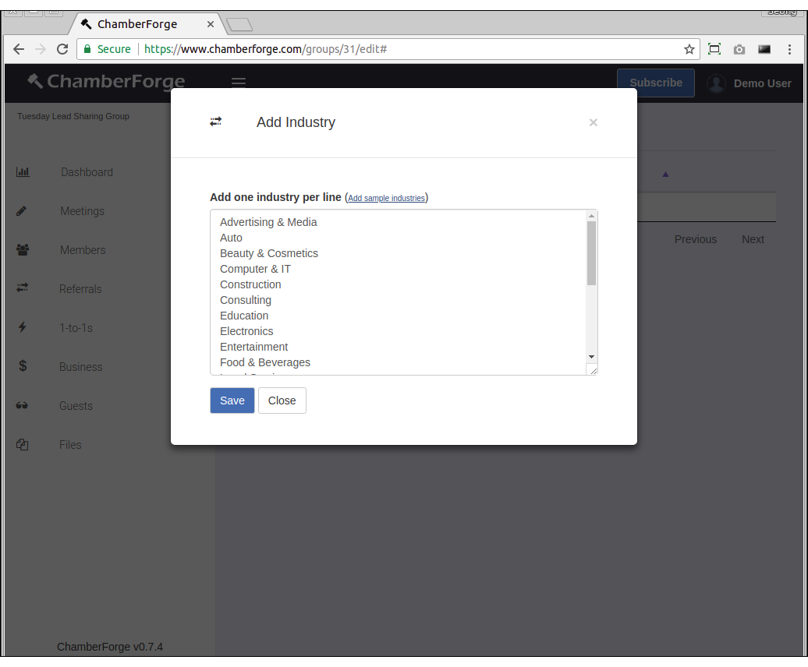
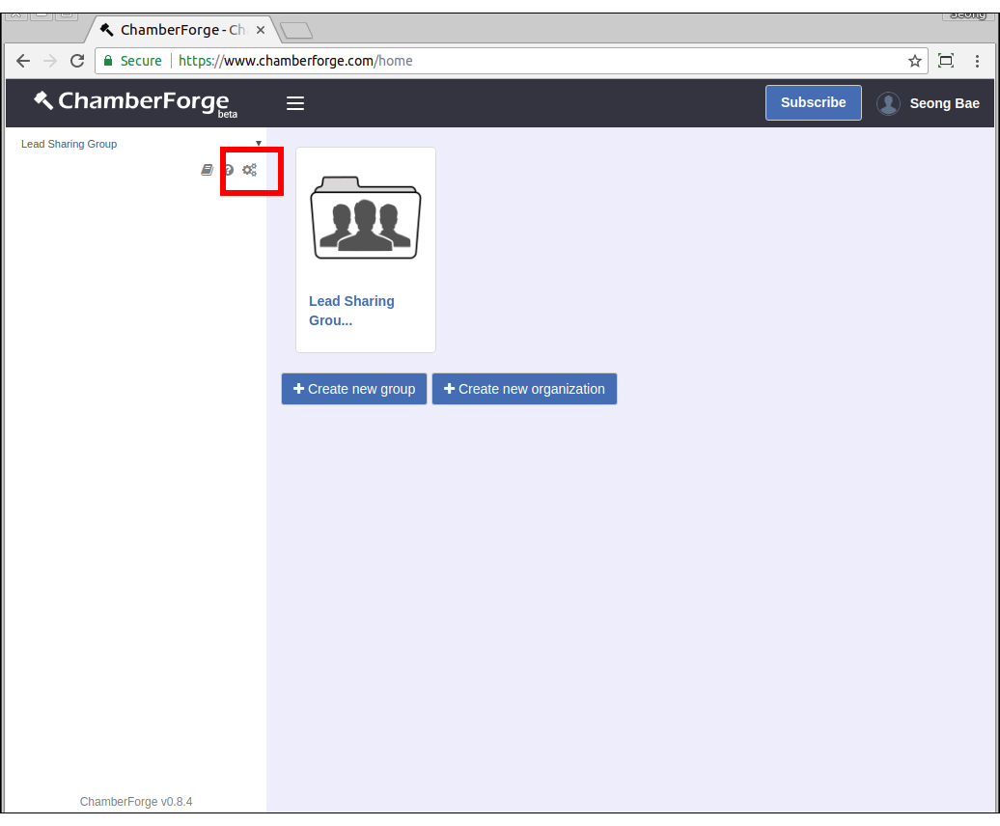
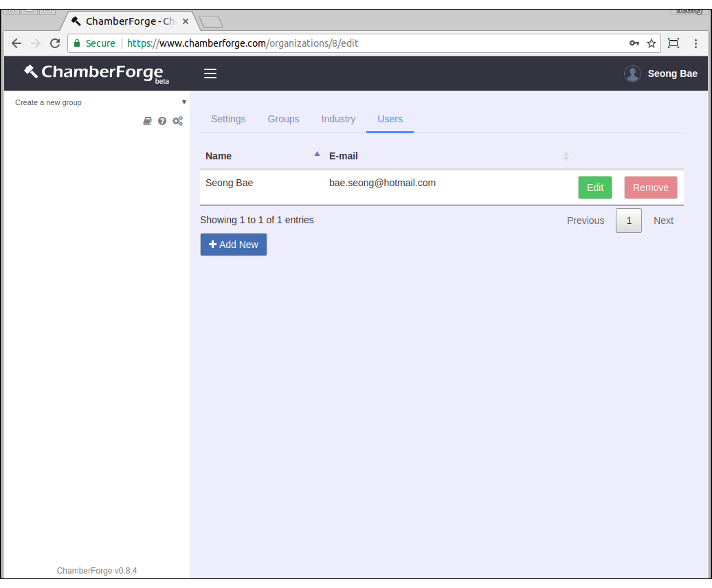
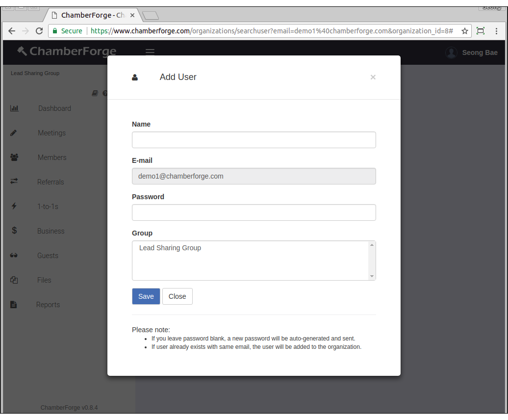
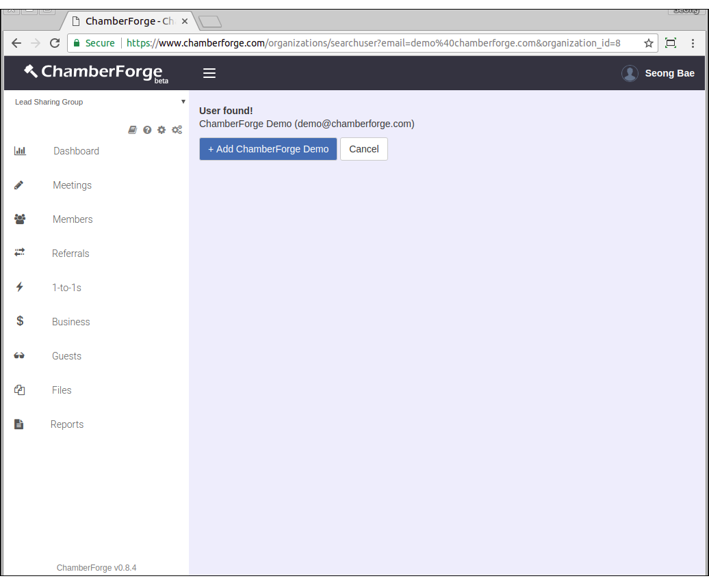
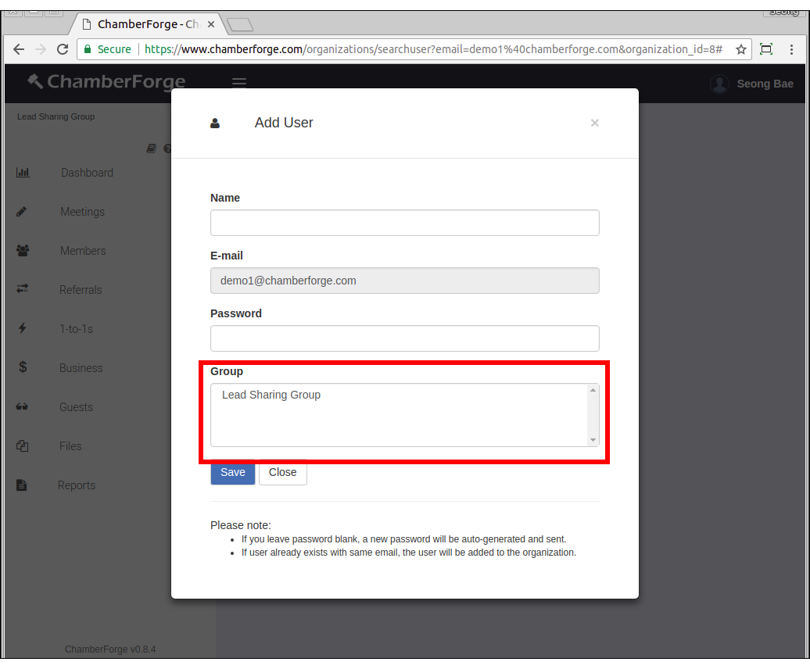
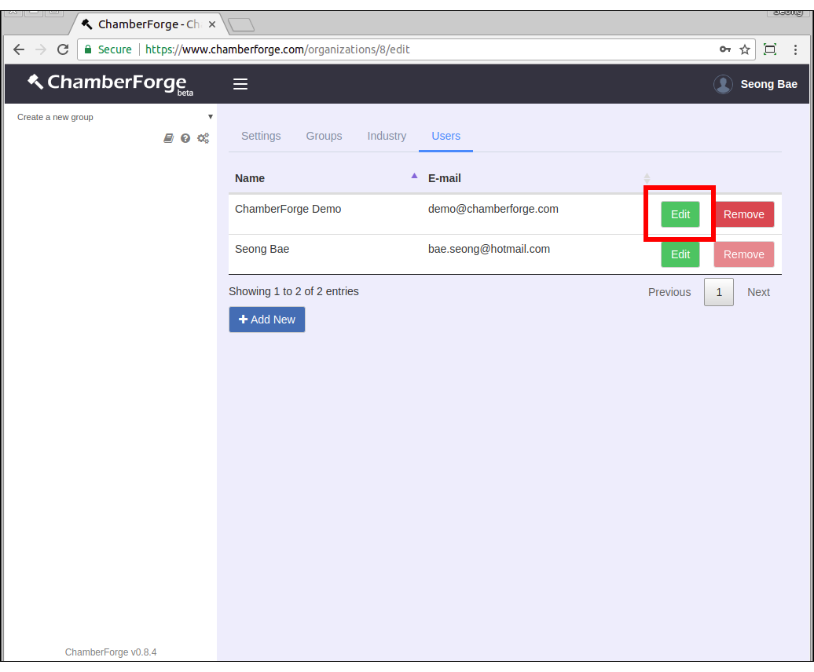

# Manage Organization

In addition to simple reporting available from each group's dashboard screen, ChamberForge allows users to generate more advanced reports.  The reports help group organizers and association staff members to quickly see how their group is doing.

## Create Organization

You can create an organization from your home screen after logging in.  Click on "Create new organization" button and give it a name.

## Create Groups

You can create groups - lead sharing groups or committees - within your organization by going to the organization settings page.  Click on the 3-gears icon on upper left corner to go into the organization settings page.

From here, you can click on the Groups tab and click "Add New" button to create a group.

* Group name - name of your group
* Type - choose from lead sharing group or committee
* Organization - select the organization this group belongs to

The difference between a lead sharing group and committee group type is a lead sharing group will allow you to track referrals, 1-to-1 meetings, and business closed.  A committee group does not have those but allows you to assign and track tasks.  Both group types allow you to manage members, guests, and meetings.

## Update Industry

When adding members and guests to a group, one of the fields is industry.  If you don't configure the Industry list, then you won't see any values under the Industry field dropdown as you add members and guests.

Industry is also used for reports.  So it is important that you configure and manage the Industry list properly.

Depending on how your group is managed, you may or may not be able to edit the Industry list.  For example, if you manage your own group and your group does not belong to any organization, then you can manage the Industry list yourself.  If, on the other hand, your group belongs to an organzation, then the organization administrator is configures the Industry list for the entire orgnaization and group managers may not be able to change it.

To configure the Industry list, click on the Industry tab and then Add Industry button.  Once a window comes up, enter industry one per line.  When done, click on Save and close the window.

## Adding Users

To add other users to your organization, follow these steps:

###1. Click on the 3-gears icon on upper left corner.

###2. Go to the Users tab in your organization settings page. Click "Add New".

###3. Search for the user with email to see if the user is already on ChamberForge.

###4. If no user with given email is found, click on "Add New" to create a new user.

###5. If user is found, click on "Add [Name of User]"

###6. When creating a new user, you can assign groups that the user should belong to.

###7. When adding an existing user, after adding the user, you should go back to the Users tab, click on Edit for the user you just added, and assign groups from there. 

