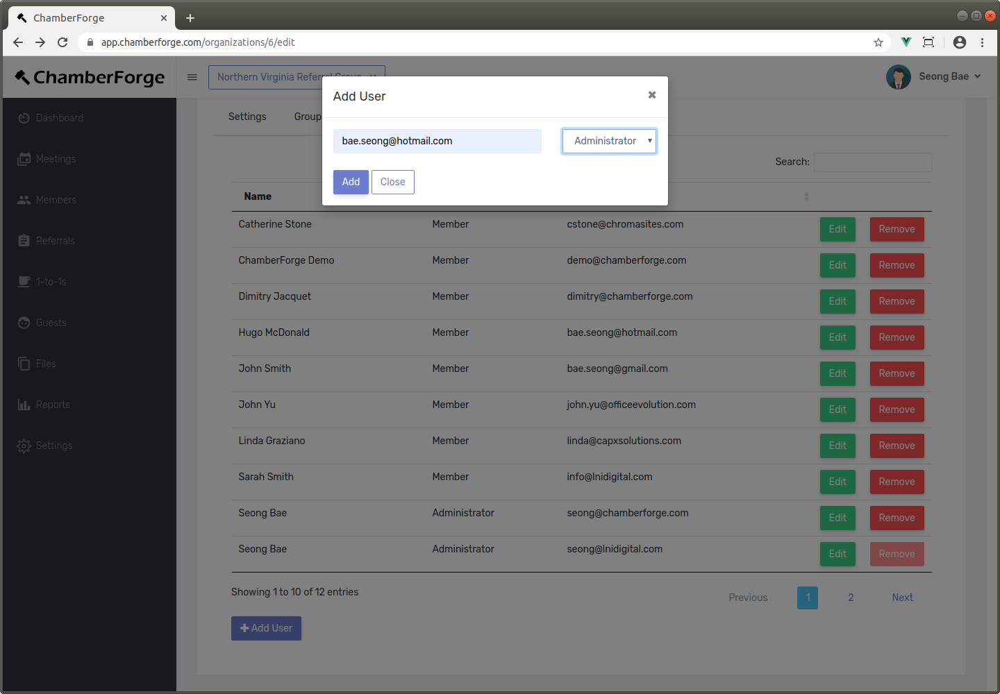
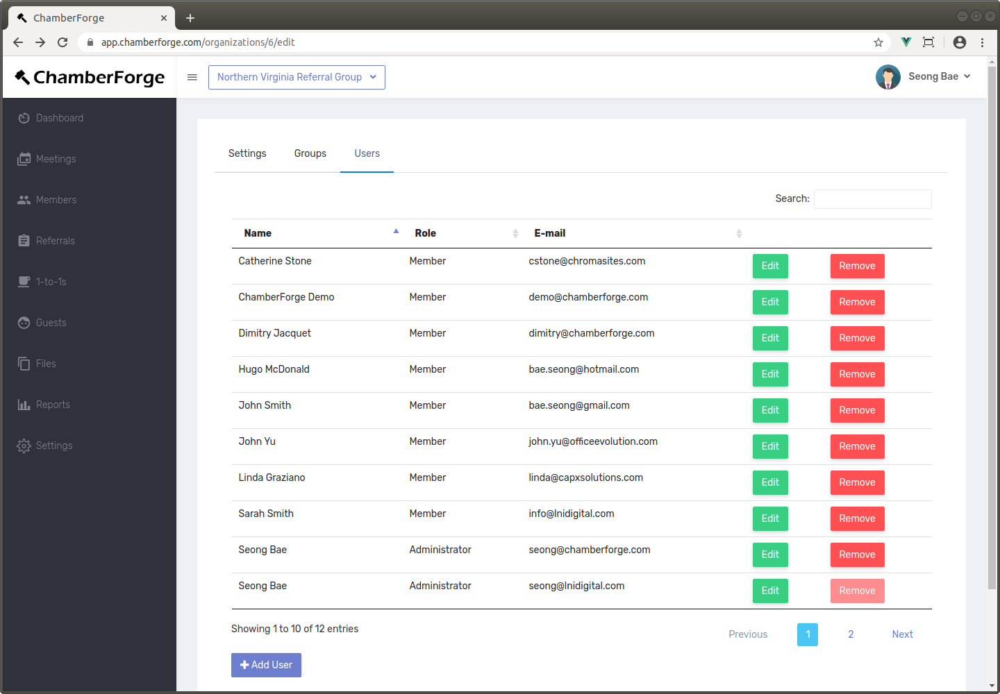
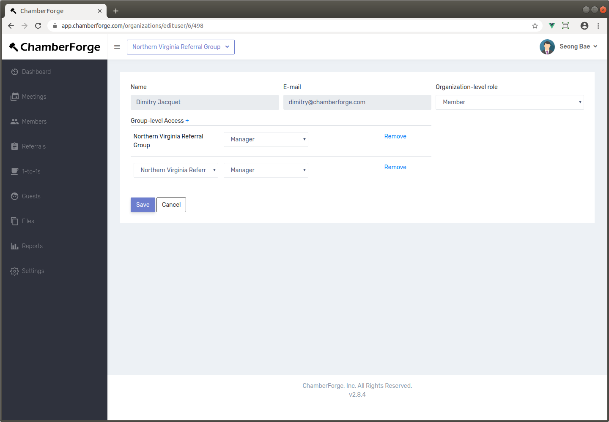

# Organization

An organization may have one or more groups in them.  If you set up an organization on ChamberForge, you can manage groups and members across the entire organization.  You can also create and manage groups.

You must have either the administrator or staff role in order to access the Organization management screen.  If you do, you will see the organization name under the menus on top right-hand corner.

## Manage Groups

If you create a new group from the Organization settings page, you will go through the New Group Creation Wizard.  However, the newly created group will be under your organization.  

You can also delete groups from this page.

## Add Members

You can add new members to the organization.  Go to the Users tab and click the Add User button.  You can add using email and also assign a role.  Roles are:

- **Administrator**: can manage the entire organization. Can add and remove members, create/delete groups, and assign group manager.  Can also handle payment-related settings.
- **Staff**: has same access as administrator except payment settings.
- **Member**: do not have any additional privileges other than just being in the organization.

## Remove Members

You can remove members from your organization.  From the Users tab, just click on Remove button.  Removing a member from this screen will remove the member from all the groups the member belongs to within the organization.  On the other hand, if you remove a member from a group, the member may still be in the organization.  So if you remove a member from a group, make sure to remove entirely by removing from the organization as well.

## Assign to Group

You can assign members to groups.  Click on Edit for any member and then the plus sign (+) next to Group-level Access.  From here, you can select a group for the member and the level of access - the role - the member will have within the group.  It can be either manager or member role.  Members with manager role can add/remove members within the group, create meetings, and update guest among other things.

> Please note that there are two levels of roles: organizational-level and group level.  For example, if you have any staff within the organization who will be assisting with managing of groups, then you'd want to give that user the Staff role within the organization but not any explicit access to the groups.  That user, by having the staff role at the organization level, will automatically have access to view and manage all the groups.

