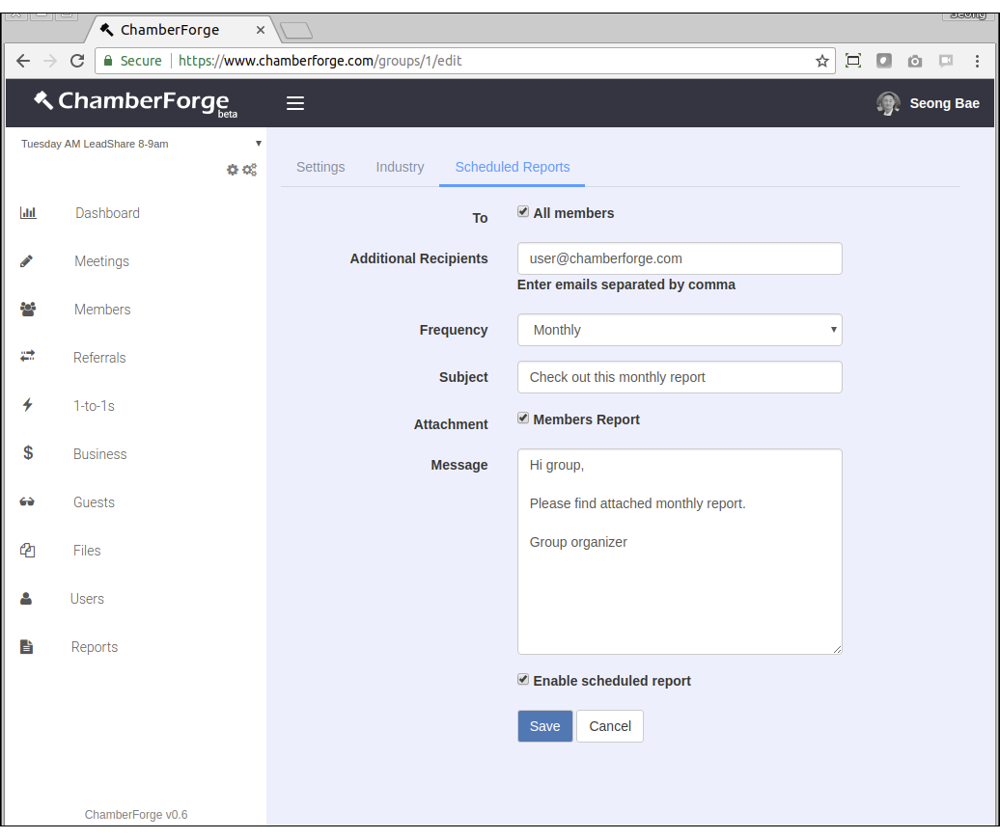
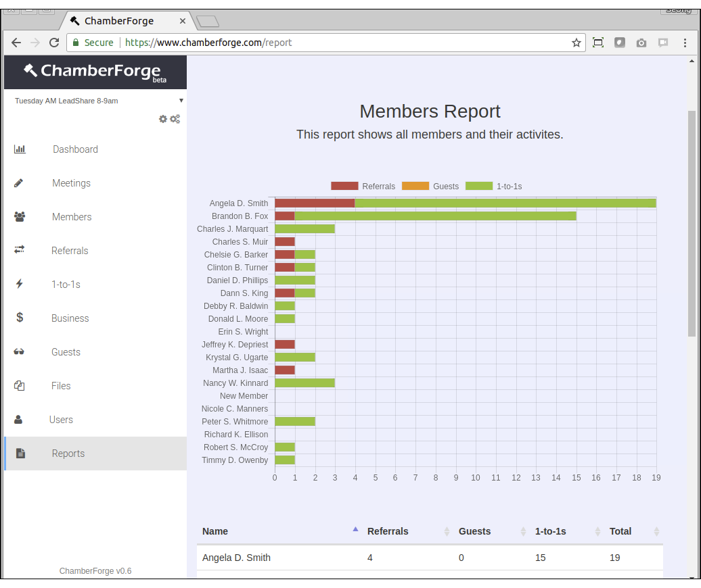
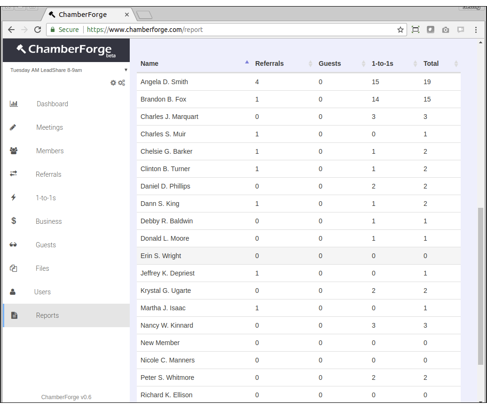

# Manage Organization

In addition to simple reporting available from each group's dashboard screen, ChamberForge allows users to generate more advanced reports.  The reports help group organizers and association staff members to quickly see how their group is doing.

## Create Organization

To generate reports, click on "Reports" on the left menu.  Enter the date period and select a type of report.  At the time of writing this documentation, two reports are available: Members report and Activity report.

## Create Groups

The Activity report is similar to the Members report but only shows total activities over period of time without showing members' name.  

## Update Industry

The Scheduled report allows users to have the reports sent out in email periodically.  You can schedule monthly, quarterly, semi-annually, and annually.  If set monthly, a report will go out on 1st of every month.  If set quarterly, it will go out on 1st of April (for January to March), 1st of July (for April to June), etc.

The report will be generated in PDF format and included in an email as an attachment.

You can have the scheduled report sent out to all members of a group, or you can add additional emails to have report sent out to those outside ChamberForge.  Or you can do both.

To set up a schedule report, go to the group settings by clicking on the gear icon on top left menu.  Then click on the Scheduled Reports tab. Following describe what each field does:

* To All Members - if this is checked, then all members of the group will receive the report
* Additional Recipients - you can specify additional emails here if you want the report to be sent out to those not in the group
* Frequency - you can set how often the report will go out
* Subject - email subject
* Attachment - select which type of report to automatically generate
* Message - body to be included in email
* Enable schedule report - you can turn on or off the schedule report by checking here

## Add Users

The Activity report is similar to the Members report but only shows total activities over period of time without showing members' name.  

## Branding Organization

The Members report shows all the members in the group and their activities during given period.  The activities include guests invited, 1-to-1 meetings had, and leads gave to others in the group.  The initial report will give sum of all those three categories for each member, but you can filter out any categories by clicking on the legends.

If you scroll down, you can also see a table that shows number of items for each category for all the members.  You can also sort the table by clicking on each column header.

