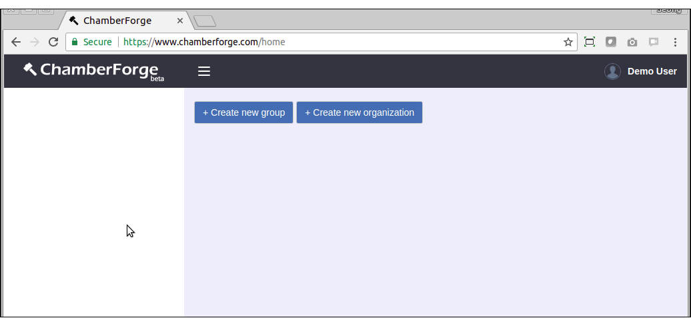
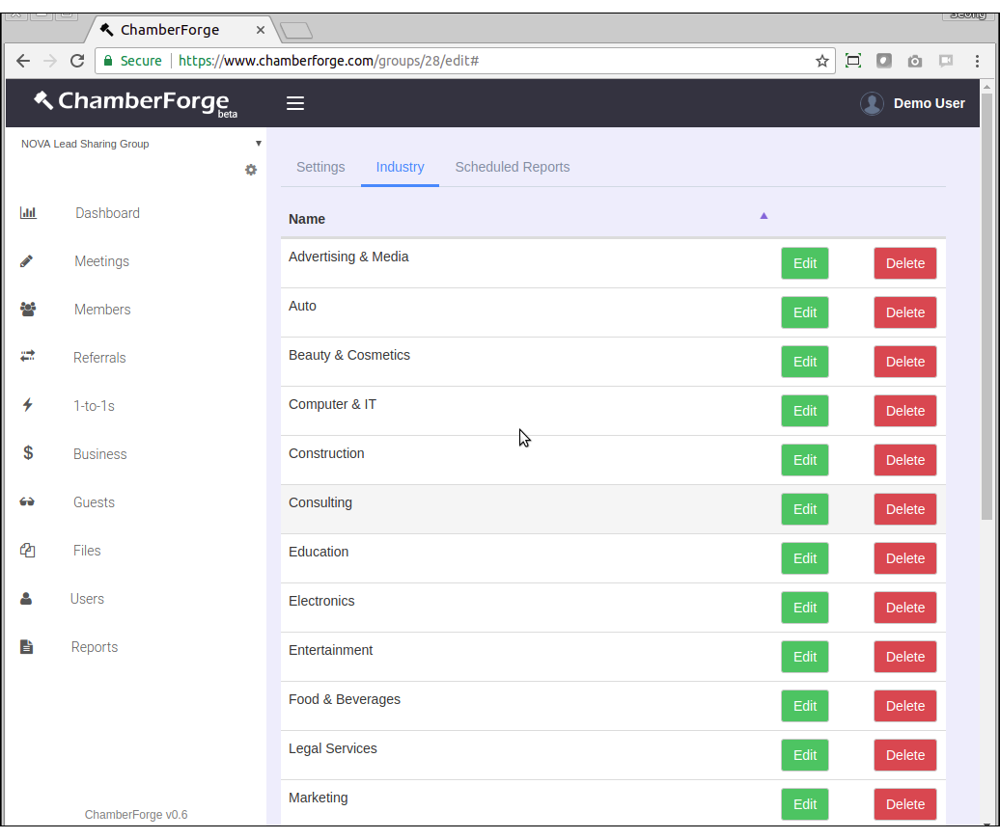
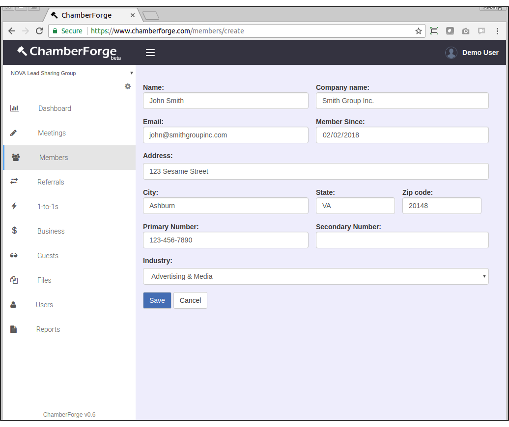
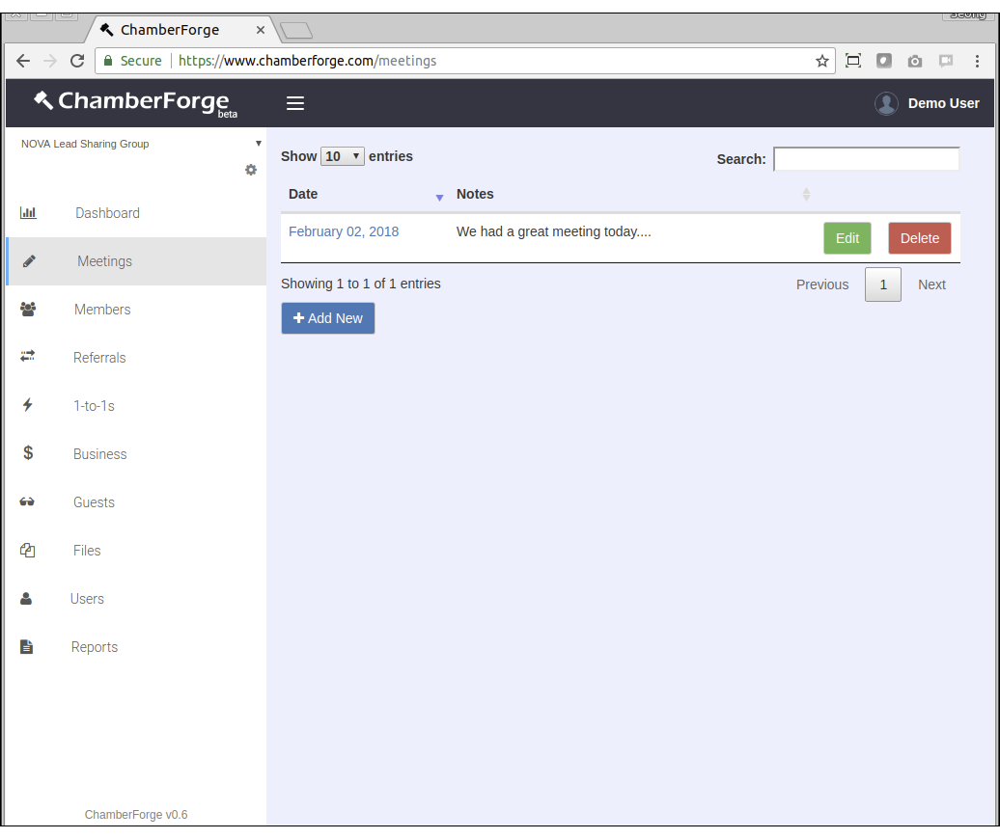
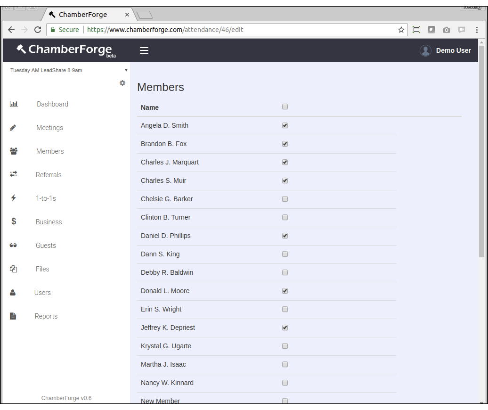
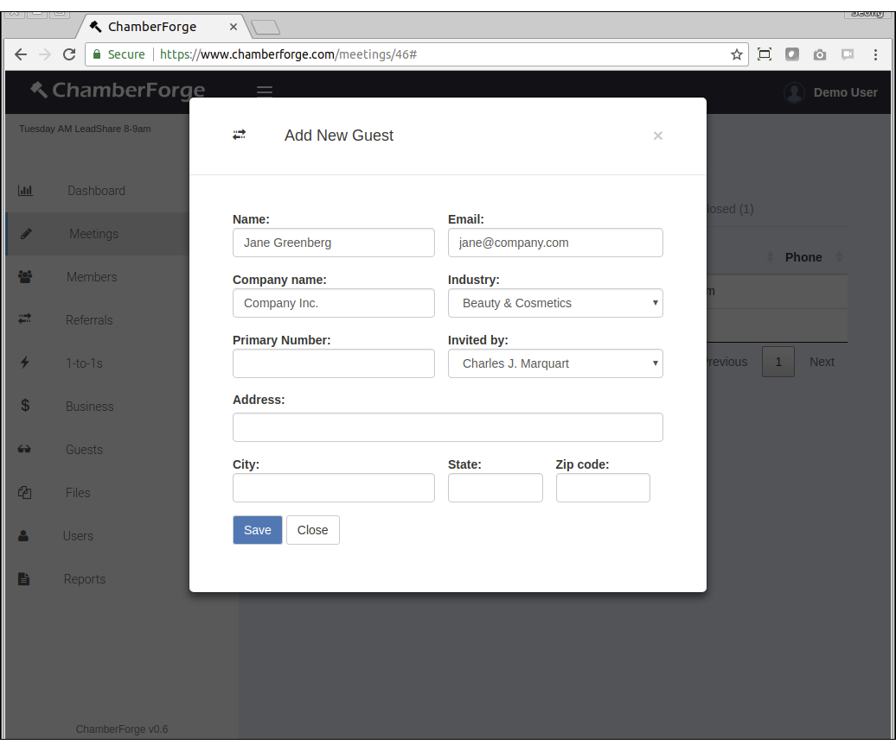
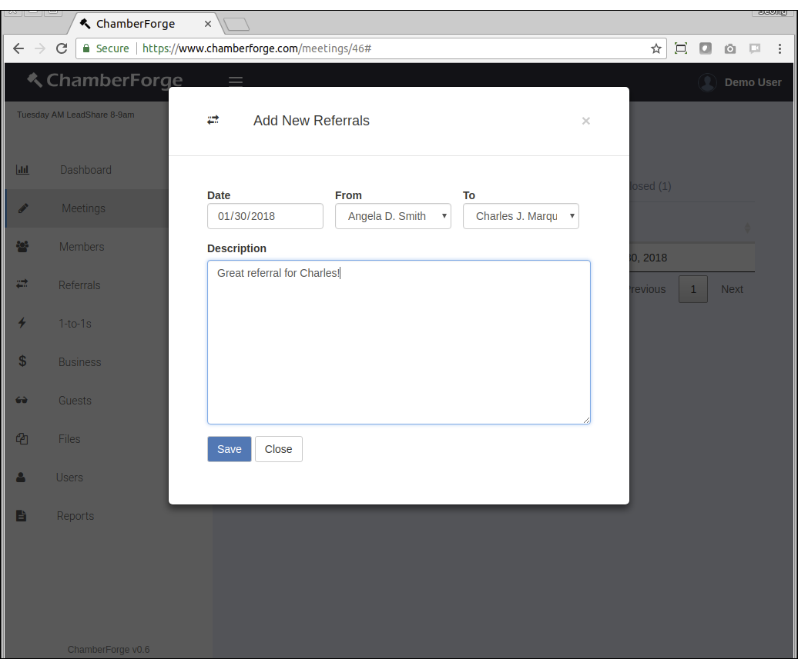
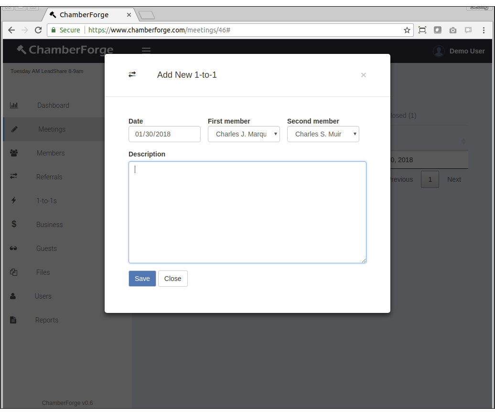
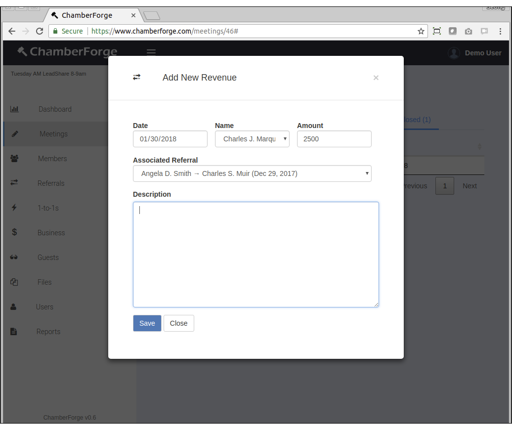

# Quickstart Guide

This guide walks you through quickly getting your group or organization up and running with ChamberForge.
	
## 1. Create an organization or a group

When you register on ChamberForge and log in for the first time, you may see options to create a group or an organization.  

**Group** - create a group if you manage a single group of members or businesses.

**Organization** - create an organization if you are with a staff with chamber of commerce or larger business associations with more than one group. If you create an organization, you can still create groups under your organization.

## 2. Configure industry

If you created an organization, click on the three-gear icon under logo on the left menu.  This will take you to the organization settings page.  If you created a group without an organization, you can click on the group to go to the group page and you will see a gear icon in the same area which takes you to the group settings page.

Once you are on the organization or group settings page, click on the Industry tab.  Then click on "Add Industry" button.

Here you can add industries per your group or organization.  Add one industry per line.  To see an example, click on the "Add sample industries" link.

After adding industries, your screen will look like below:

## 3. Add members

Next step is to add members of your group.  Click on Members menu from left side. Click "Add New" button and start adding one member at a time.  The only required fields are name and email - all other fields are optional.

## 4. Add a meeting

After adding members, you are done with setting up the group.  Now, after a weekly or bi-weekly meeting where members get together to report out various activities including 1-to-1 meetings, leads for other members, and guests invited, you can create a meeting in ChamberForge to track all the information.

Click on Meetings on the left menu and add a new meeing.

## 5. Update attendance

For each meeting held, you can use ChamberForge to keep track of attendance of members and guests.  To do so, click on the meeting you just created in the above step.  The first tab you will see is attendance tab.

Click on the "Update Attendance" button at the bottom.  You will then see a list of members and a checkbox next to their name. Click on each checkbox to note attendance for each member.  If you have many members, you can click the topmost checkbox and it will automtically check everyone.

## 6. Add guests

If you have guests who attended a meeting, you can add their information.  From the meeting page, click on the second tab that says "Guests" and click on "Add New Guest" button at the bottom.  A window will pop up where you can add guest information.

You can add as many guest as you want and close the window when done.

## 7. Add referrals/leads

If members reported out any leads or referrals they gave to others, that information can be captured in ChamberForge.

From the meeting details screen, click on the third tab called "Referrals." Click on the "Add New" button at the bottom and you can enter details about the lead.

## 8. Add 1-to-1 meetings

When members report out that they had 1-to-1 meeting with other members, you can add this information to ChamberForge.

From the meeting details creen, click on the fourth tab called "1-to-1s." Click on the "Add New" button at the bottom and you can enter details about the meeting.

## 9. Add business closed

When members report out that they had business closed, you can add this information to ChamberForge.

From the meeting details creen, click on the fifth tab called "Business closed." Click on the "Add New" button at the bottom and you can enter details about the meeting.

The only required information is date and name.  The amount and associated referral fields are optional and can be left blank.

That's pretty much it for the quickstart guide.  Now you can repeat step 4 through step 9 for each meeting held.  Once you have some data in the system, you can generate reports. 