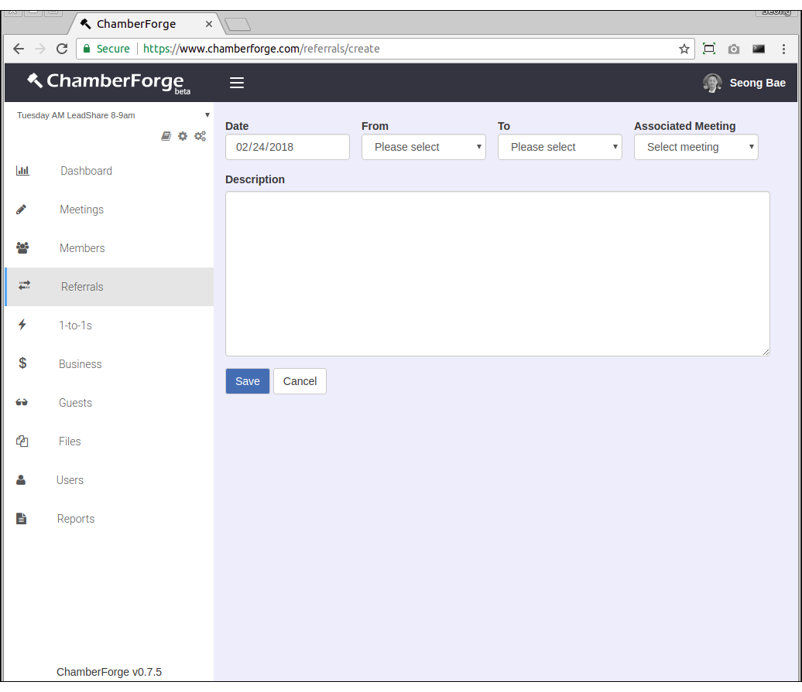
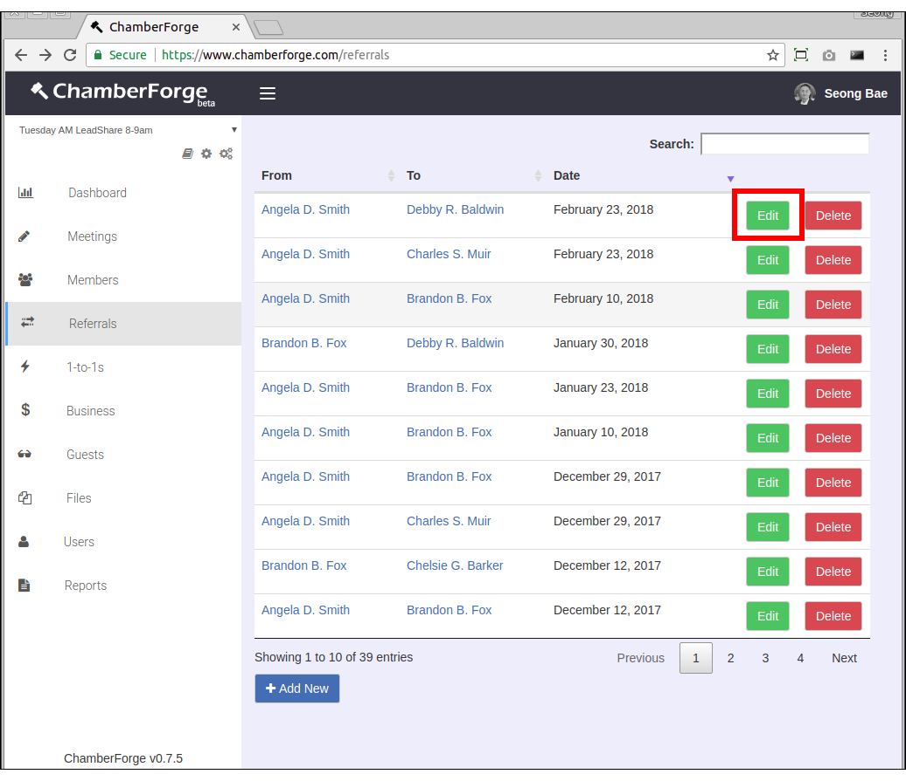
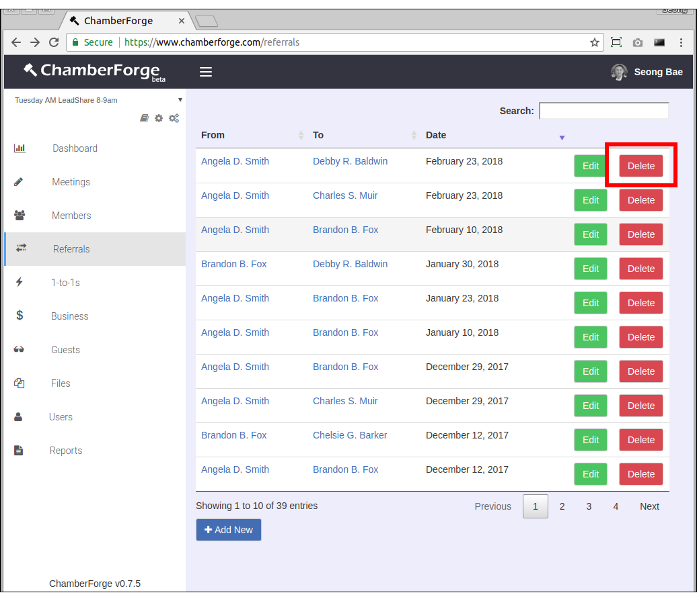
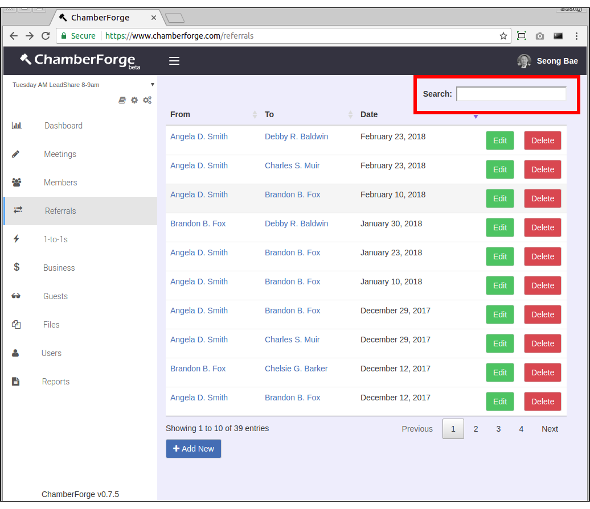

# Referrals

## Add a Referral

You can add referrals by going to Referrals from left navigation menu and clicking on the Add New button.

The only required field is the person giving a referral - rest of the fields are optional.  Following are fields on the Referral's Add New page:

- **Date**: Date of the referral
- **From**: Person giving the referral (Required)
- **To**: Person receiving the referral
- **Associated Meeting**: If this referral was reported at a meeting, you can associate the referral to the meeting
- **Description**:  Any additional information about the referral

## Edit Referral

You can edit an existing referral by clicking on the Edit button on the Referral you want to edit from the Referrals screen.

## Delete Referral

You can delete an existing referral by clicking on the Delete button on the Referral you want to delete from the Referrals screen. 

## Search Referral

You can search referrals by member name.  Use the search field on top right hand corner to filter referrals by name.

