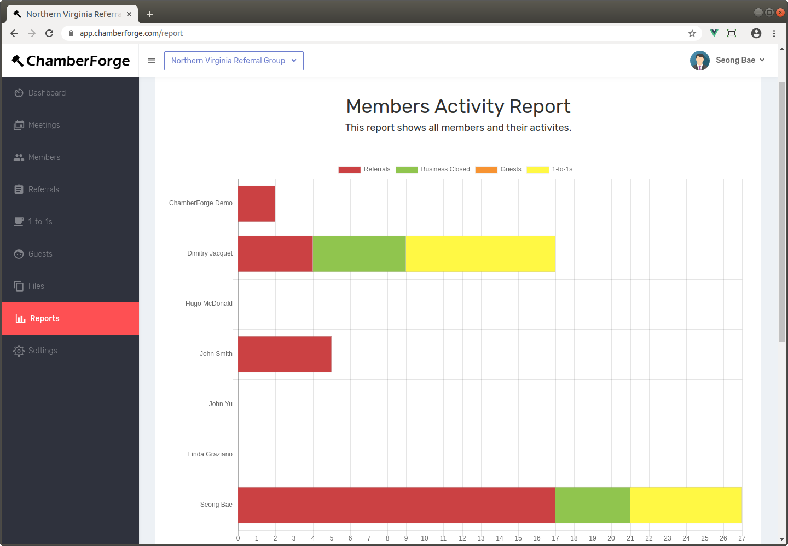
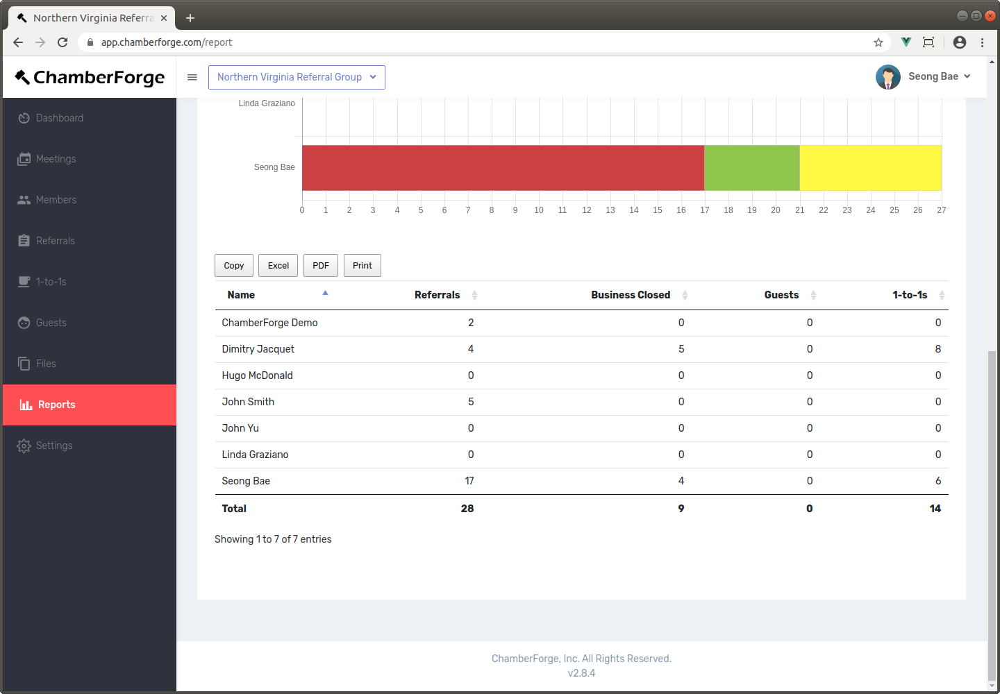
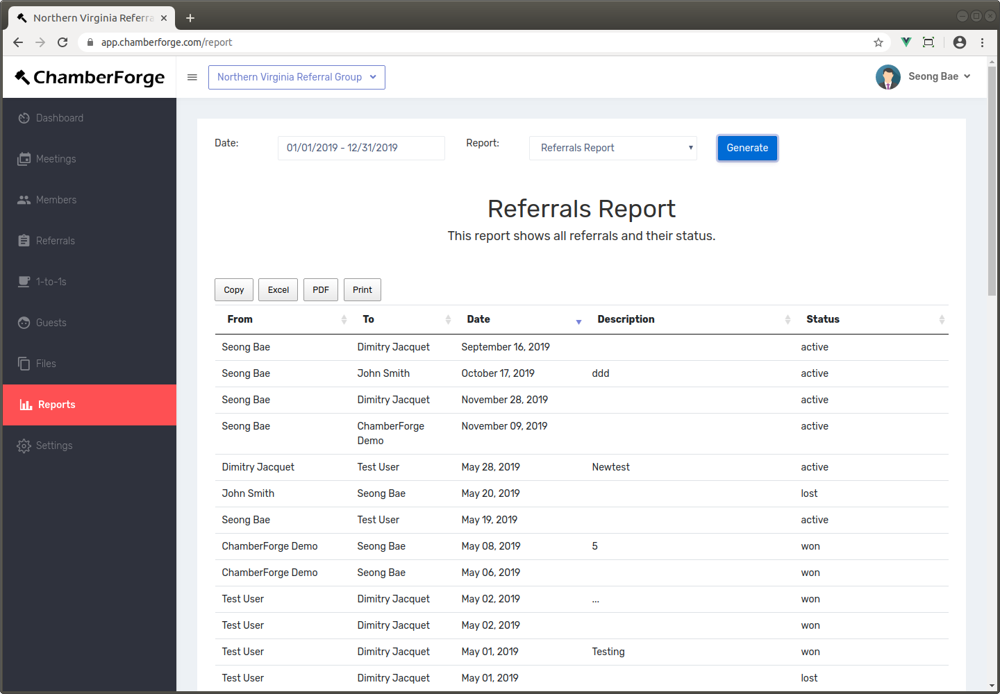
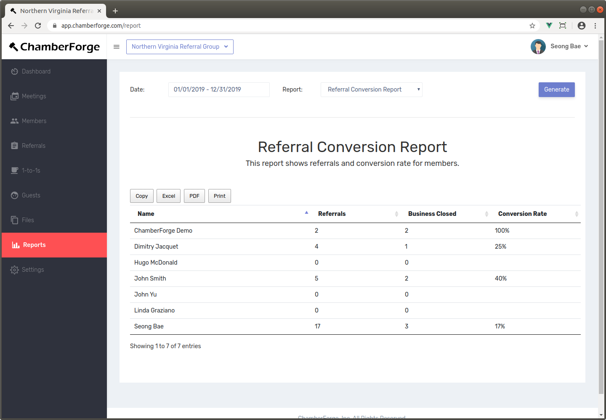
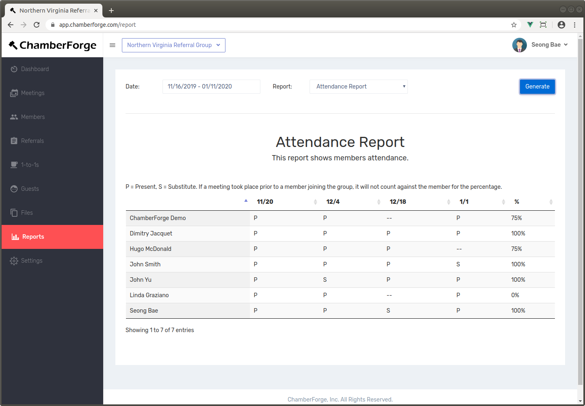

# Reporting

In addition to simple reporting available from each group's dashboard screen, ChamberForge allows users to generate more advanced reports.  The reports help group organizers and association staff members to quickly see how their group is doing.

You can generate reports to quickly find out:

* Who's actively contributing to the group? 
* How are members doing with 1-to-1 meetings over period of time?
* Are referrals being passed to one another?
* Are members converting their referrals?
* Are members meeting their monthly/quarterly goals set forth by group leaders?  
* Where do we need to focus more on as group leader or staff member?

## Generating Reports

To generate reports, click on "Reports" on the left menu.  Enter the date period and select a type of report.  At the time of writing this documentation, two reports are available: Members report and Activity report.

Below are reports currently available in ChamberForge.  If you have access to the ChamberForge API, you can generate custom reports using tools of your choice such as Google Sheets, Google Data Studio, etc.  If you need assistance with custom reports, please contact us at <a href="mailto:support@chamberforge.com">support@chamberforge.com</a>.

## Members Report

The Members report shows all the members in the group and their activities during given period.  The activities include guests invited, 1-to-1 meetings had, and leads gave to others in the group.  The initial report will give sum of all those three categories for each member, but you can filter out any categories by clicking on the legends.

Legends are:

- **Referrals**: number of referrals a member gave during the specified period
- **Business Closed**: number of business closed during the specified period
- **Guests***: number of guests a member invited.  This is driven by the "Invited by" field when adding a guest data.
- **1-to-1s**: Number of 1-to-1 meetings a member had during the specified period.

> Currently, guests are counted based on their entry into the system, not number of meetings they came to.  For example, if John invites one guest and the guest came to two meetings, this will still be counted as one guest on the report.
> in the future than in the past.

> To avoid confusion, 1-to-1s are based on self-reporting only. For example, if John and Mary had 1-to-1 meeting, and John reports the meeting with Mary but Mary doesn't, Mary will not get a credit for 1-to-1.  At the moment, both John and Mary have to report.

If you scroll down, you can also see a table as shown below that has the same information in a tabular format.  This table also gives you totals for all activities.  You can export this data into PDF or Excel where you can do further analysis or share with your group.

---

## Referrals Report

The Referrals Report shows all referrals generated during the specified time period and their current status.

---

## Referral Conversion Report

The Referral Conversion Report shows conversion rate for the referrals given by members during specified period.

---

## Attendance Report

Attendance report shows member attendances during a given period of time.  The last column shows aggregate percentage of attendance rate for each member.

Legends are:

- P denotes member was **present** at the meeting. 
- S denotes **substitute** attendance.  
- No letter (--) indicates not present at the meeting.

> Please note that the member's group join date is used when calculating the total attendance percentage. For example, if John joins a group in March, and you are generating the attendance report from January to June, John's absence in January and February will not be counted against him.  Therefore, for the attendance report to show correctly, you should set the group join date for all the members in your group.

## Revenue Earned Report

This report shows all the revenues earned by members during specified time period.  Average transaction size is calculated by dividing the revenue by referrals.

## Revenue Referred Report

This report is similar to the Revenue Earned Report except this one shows revenues referred by members to other members.

