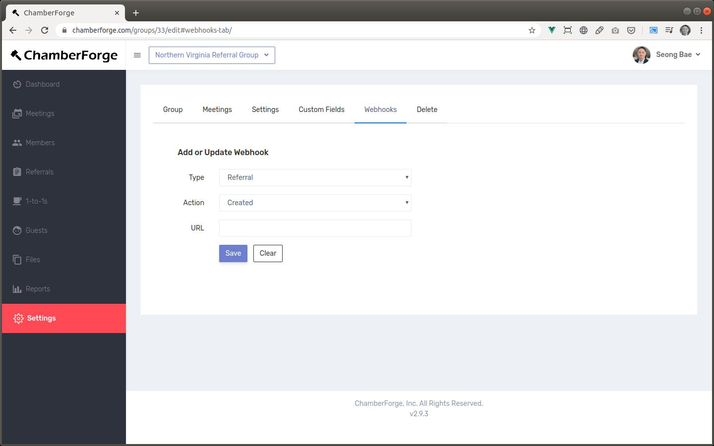

# Webhooks

Webhooks allow you to send data from ChamberForge to external systems.  A good example is, if you have a marketing automation or email marketing platform such as HubSpot, Marketo, or Active Campaign, you can use the webhooks feature to automatically send guest data from ChamberForge to those platforms.  Whenever your members add new guest into ChamberForge, it will automatically sync with external platforms.

Since ChamberForge is not an email marketing or lead management platform, some groups utilize those external platforms to do further marketing to guests. If you are one of those groups, then webhooks will allow you to do that.  It will send new guest data, update existing data, and also delete data.  

Webhooks are support on the following content types: guest, referral, 1-to-1.  Operations supported at create, update, and delete.  At this time, webhooks are supported only on the Group Plus plan.

## Create a webhook

You can create webhooks by going to the Group Settings and Webhooks tab.  On this screen, you can add new webhooks, updating exsting ones, and delete webhooks.

- **Type**: Choose which content type you want to send
- **Action**: Choose operation: created, updated, deleted
- **URL**: Webhook client URL - where to send data

## Webhook clients

Not all external tools support receiving webhooks.  We recommend integrating with [Zapier](https://zapier.com){:target="_blank"} which connects with many applications out there.

## Video tutorial

You can also watch the below YouTube video on more detailed walkthrough of how to creat and manage webhooks.

{:target="_blank"} 